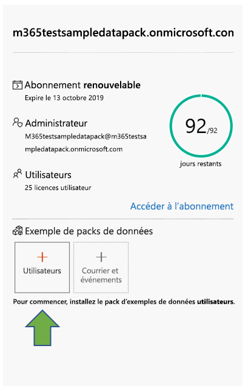
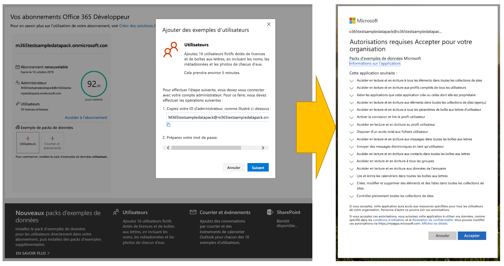
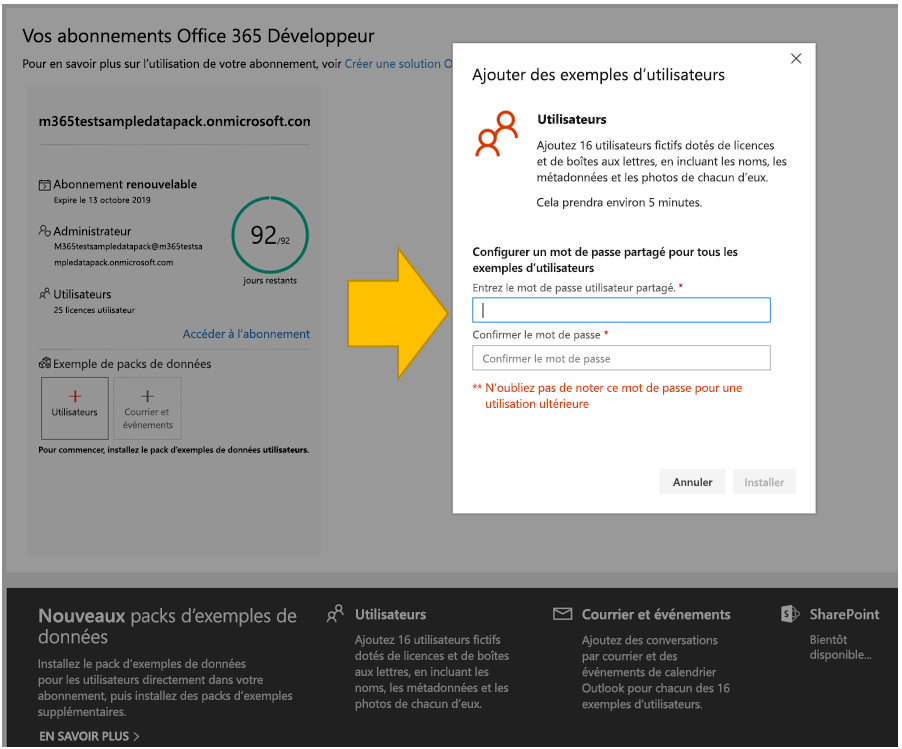
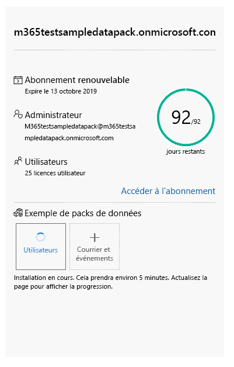
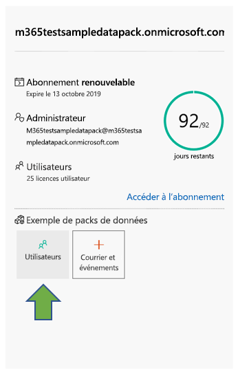
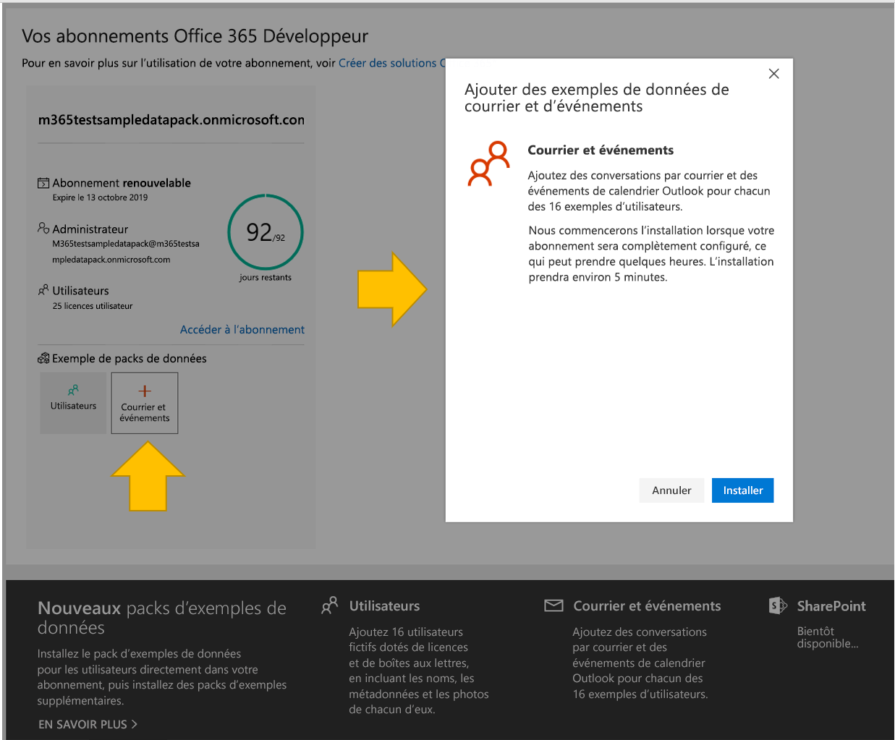
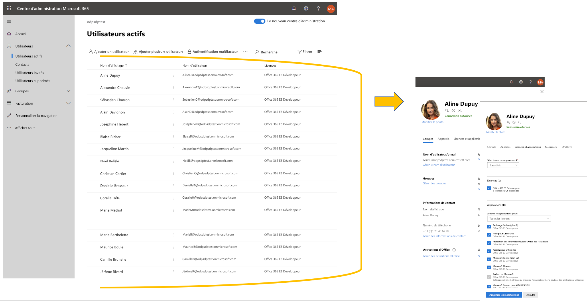
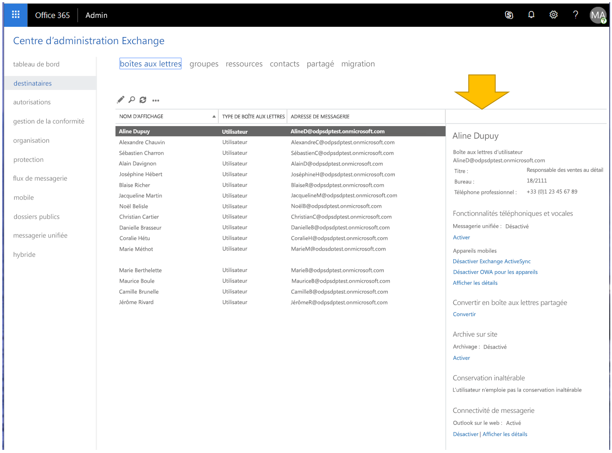

# Utiliser des packs d’exemples de données avec votre abonnement au programme Microsoft 365 Développeur

Vous pouvez installer des packs d’exemples de données dans votre abonnement au programme Microsoft 365 Développeur. Les packs d’exemples de données vous permettent de gagner du temps en installant automatiquement des données et le contenu nécessaire pour créer et tester vos solutions. Ceci inclut des utilisateurs, des métadonnées et des photos fictives pour simuler un petit environnement d’entreprise. Vous pouvez rapidement installer des exemples de données afin de pouvoir vous concentrer sur vos solutions plutôt que de consacrer du temps à créer des exemples de données vous-même.

Des packs d’exemples de données sont disponibles dans le [Tableau de bord de votre programme Microsoft 365 Développeur](https://developer.microsoft.com/office/profile), au bas de la vignette de votre abonnement.

Les packs d’exemples de données suivants sont actuellement disponibles :

- Utilisateurs : Installe 16 utilisateurs fictifs dotés de licences, de boîtes aux lettres et de métadonnées, en incluant les noms et les photos de chacun d’eux. Utilisez les API Microsoft Graph pour utiliser les exemples de données utilisateur de l’une des manières suivantes :
  - Obtenir des informations spécifiques sur un utilisateur
  - Mettre à jour un utilisateur
  - Obtenir des collaborateurs
  - Préparer l’organigramme  
  - Obtenir des utilisateurs par service

- Courrier et événements : Ajoute des conversations par courrier et des événements de calendrier Outlook pour chacun des 16 exemples d’utilisateurs. Utilisez les API Microsoft Graph pour utiliser les exemples de données de courriers et d’événements de l’une des manières suivantes :
  - Obtenir les courriers électroniques par utilisateurs
  - Obtenir les courriers électroniques filtrés par date
  - Obtenir les événements à venir
  - Mettre à jour/supprimer les événements à venir

> [!NOTE]
> Avant d’installer les applications Courrier et Événements, vous devez installer le pack d’exemples de données Utilisateurs.

## Quelle est la valeur ajoutée des packs d’exemples de données ajoutés à mon abonnement ?

Le pack d’exemples de données Utilisateurs crée 16 utilisateurs fictifs pour votre abonnement et inclut les licences pour chaque utilisateur, ainsi que les boîtes aux lettres, les noms, les métadonnées et les photos pour chacun d’entre eux.

Le pack d’exemples de données Courrier et Événements ajoute des conversations par courrier et des événements de calendrier Outlook pour chacun des 16 exemples d’utilisateurs.

## Comment installer le pack d’exemples de données Utilisateurs ?

Avant d’installer le pack d’exemples de données Utilisateurs, assurez-vous que vous disposez d’un abonnement Microsoft 365 Développeur et que vous vous attribuez une licence en d’administrateur.

> [!NOTE]
> Assurez-vous que 16 utilisateurs sont disponibles dans votre abonnement. Votre abonnement inclut 25 utilisateurs. Si vous avez déjà configuré plus de 10 utilisateurs, supprimez d’abord certains utilisateurs afin de vous assurer que l’installation réussit.

Pour installer le pack d’exemples de données Utilisateurs, procédez comme suit :

1. Cochez la case **Utilisateurs** au bas de la vignette de votre abonnement.
2. Copiez votre ID d’administrateur ; vous en aurez besoin pour vous connecter à votre abonnement.
3. Saisissez votre ID administrateur et votre mot de passe sur la page de connexion.
4. Accordez-vous les autorisations d’administrateur de votre abonnement Microsoft 365 Développeur.

5. Configurez vos mots de passe pour tous les échantillons d’utilisateurs. Vous devrez définir un mot de passe partagé pour faciliter l'administration de tous vos utilisateurs fictifs.

6. Les données sont installées. L’installation devrait prendre environ 5 minutes.

7. Une fois l’installation terminée, vous recevez une notification par courrier électronique. La case de la vignette de votre abonnement devient verte. Vous pouvez désormais installer les packs d’exemples de données Courrier et Événements.

## Comment installer les packs d’exemples de données Courrier et Événements ?

Après avoir installé le pack d’exemples de données Utilisateurs, vous pouvez installer les courriers et les événements.

1. Cochez la case **Courrier &amp;Événements** sur la vignette de votre abonnement.
2. Sélectionnez **Installer** pour commencer l’installation.

> [!NOTE]
> Si vous venez de créer votre abonnement, celui-ci doit être complètement configuré avant que l’installation puisse commencer. Cette étape peut prendre jusqu’à quelques heures. Une fois l’installation démarrée, l’opération peut prendre jusqu’à 20 minutes.

3. Une fois l’installation terminée, vous recevez une notification par courrier électronique. La case de la vignette de votre abonnement devient verte.

## Comment installer le pack d’exemples de données SharePoint ?

Le pack d’exemples de données SharePoint inclut sept modèles de sites SharePoint différents à choisir pour expérimenter, puis modéliser des solutions SharePoint pour la collaboration, la communication, l’engagement et la gestion des connaissances.

Voici quelques-uns des modèles les plus populaires du [look book SharePoint PnP](https://provisioning.sharepointpnp.com/). Aujourd’hui, il est facile de créer des exemples de solutions de sites et de pages magnifiques et d’accès rapide qui offriront une apparence remarquable sur tous les appareils ou écrans. Inspirez-vous de ces conceptions ou ajoutez-les à votre client bac à sable pour commencer à créer votre prochain site.

Vous pouvez installer les modèles lors de votre abonnement. Après installé un modèle, vous pouvez installer les autres. Le processus d’installation inclut les étapes suivantes :

1. Sélectionnez le modèle désiré dans le menu déroulant.

  

2. Configurez des options personnalisées de vos sites ou acceptez les valeurs par défaut.
3. Utilisez l’ID d’administrateur et le mot de passe de votre client bac à sable pour vous authentifier, puis accorder les autorisations d’installation. 

L’installation s’effectue automatiquement.

>**Remarque :** la mise en service de ces modèles de site fonctionne uniquement avec les abonnements anglais d’Office 365 E3 ou de Microsoft 365 E5 pour les développeurs, et tout le contenu inclus est uniquement en anglais.

## Quels sont les modèles SharePoint disponibles ?

L’exemple de pack SharePoint inclut sept modèles différents.

### Site d’équipe avec des données

Le modèle Site d’équipe avec des données comporte plusieurs listes et bibliothèques de documents automatiquement associées à un site d’équipe SharePoint qui vous permettent de développer des solutions à l’aide de SharePoint Framework, PowerApps et Microsoft Graph.

Ce modèle inclut les données suivantes :

- Liste de contacts préremplie
- Liste remplie de plus de 6 000 éléments
- Bibliothèques de documents avec des exemples de documents PowerPoint, Excel, Word et OneNote
- Liste d’événements avec des éléments d’annonces

Ce modèle s’intègre aux exemples de données Utilisateurs.

### Work @ Contoso
Le modèle Work @ Contoso comporte plusieurs collections de sites qui sont toutes associées automatiquement au site hub pour montrer comment marchent toutes les fonctionnalités d’agrégation par défaut.

Ce modèle contient les structures et les éléments suivants :

- Collection de sites principale définie en tant que site hub
- Deux sites de communication d’associations caritatives associés au site hub
- Un site d’équipe de travail associé au site hub
- Des exemples d’articles d’actualités dans les collections de sous-sites
- Des exemples de fichiers Word, Excel et PowerPoint.
- Exemples d’images utilisés dans les collections de sites

Les collections de sous-sites utilisent les mêmes modèles que vous pouvez également configurer séparément depuis ce service.

>**Remarque :** si vous appliquez ce modèle sur un site de communication existant, cela remplace le contenu de la page d’accueil du site.

### Connexion de Leadership : actualités de Leadership, événements, engagement

Ce site d’équipe de direction fournit des informations sur les objectifs et les priorités de l’équipe de direction, et stimule l’engagement grâce à des événements et des discussions.

L’ajout de cette conception à votre client crée le contenu suivant :

- Exemple de page d’accueil avec démonstration de composants WebPart
- Exemples d’articles d’actualités démontrant plusieurs conceptions de page modernes

Ce modèle s’intègre aux exemples de données Utilisateurs.

### Accueil : actualités, ressources, contenu personnalisé

Nous avons conçu ce site de communication pour permettre à vos employés de trouver les informations et les ressources dont ils ont besoin, ainsi que du contenu personnalisé adapté à leurs besoins.

L’ajout de cette conception à votre client crée les contenus suivants :

- Une structure de démonstration pour le site d’accueil du portail
- Une structure de page d’accueil personnalisée
- Six autres exemples de pages modernes et d’articles d’actualités
- Des exemples d’images et de documents Office

### Perspective : actualités, vidéo, contenu personnalisé

Conçu pour fournir des informations et des contenus personnalisés, ce site inclut également des vidéos pour renforcer l’engagement.
L’ajout de cette conception à votre client crée les contenus suivants :

- Des conceptions de page d’accueil personnalisées
- Un exemple de modèle de page pour les articles d’actualités
- 12 exemples d’articles d’actualités

### Hub d’intégration des nouveaux employés : se connecter, s’engager, informer

Simplifiez, puis affinez votre processus d’intégration de nouveaux employés avec des modèles prédéfinis qui couvrent les scénarios de pré-intégration, d’intégration au niveau de l’entreprise et les scénarios d’intégration au niveau du service. Cette solution numérique propose quatre modèles de sites différents dotés de contenus déjà remplis, que vous pouvez personnaliser selon les objectifs de votre organisation.

L’ajout de cette conception à votre client crée le contenu suivant :

- Un site de préintégration, un site d’intégration d’entreprise et deux sites d’intégration de service
- Des pages d’accueil personnalisées et préremplies pour chaque site
- Un site hub configuré pour l’intégration d’entreprise et des sites associés pour l’intégration de service
- Une liste de contrôle des nouveaux employés basée sur des listes SharePoint pour aider les nouveaux employés à s’intégrer correctement
- Des exemples de contenus pour le composant WebPart Contacts, le composant WebPart Yammer, le composant WebPart Actualités et le composant WebPart Liens rapides
- Des foires aux questions préremplies pour chaque site
- Des recommandations relatives à la création d’expériences sociales et attrayantes, telles que l’ajout d’une vidéo de bienvenue à l’aide du composant WebPart YouTube sur le site de pré-intégration

### Communications de crise : annonces, actualités, ressources, communautés et appels à l’action

Restez informé, engagé et progressez en cas de crises d’événements météorologiques extrêmes dans un état de santé et d’urgence. Ce modèle crée une ressource centralisée permettant aux leaders et aux communicateurs de partager des actualités et annonces importantes. Cette source unique de vérité permet aux gens de s’informer et constitue un lieu de connexion des membres de l’ensemble de l’organisation.

L’ajout de cette conception à votre client crée le contenu suivant :

- Page d’accueil personnalisée conçue à l’aide d’un composant WebPart
- Quatre articles d’actualités avec un exemple de contenu

Ce modèle s’intègre aux exemples de données Utilisateurs.

## Y aura-t-il d’autres packs d’exemples de données ?

Oui. Dans le futur, nous allons ajouter des packs d’exemples de données pour d’autres produits et technologies, notamment Microsoft Teams. Si vous avez des suggestions pour des packs d’exemples de données souhaitez, veuillez [nous le faire savoir](https://officespdev.uservoice.com/forums/224641-feature-requests-and-feedback?category_id=171306).

## Puis-je installer des packs d’exemples de données sur mes autres abonnements Microsoft 365 ?

Non. Ces exemples de packs de données sont uniquement compatibles avec l’abonnement Microsoft 365 développeur que vous obtenez dans le cadre du programme Microsoft 365 développeurs.

## Comment puis-je voir les exemples de données dans mon abonnement ?

Pour afficher les noms des utilisateurs ajoutés après avoir installé le pack d’exemples de données Utilisateurs, accédez au [**Centre d’administration Microsoft 365**](https://admin.microsoft.com/) sur votre abonnement Microsoft 365 pour les développeurs. Sous **Utilisateurs**, sélectionnez **Utilisateurs actifs**. La liste qui apparaît contient les noms de 16 utilisateurs. Vous pouvez sélectionner un utilisateur pour afficher les métadonnées associées, notamment les photos et les licences.

Pour afficher les exemples de données après avoir installé le pack d’exemples Courrier et utilisateurs, accédez au [**Centre d’administration Microsoft 365**](/microsoft-365/admin/admin-overview/about-the-admin-center?view=o365-worldwide), choisissez **Afficher tout**, puis sélectionnez **Exchange**. Dans le Centre d’administration Exchange, lorsque vous sélectionnez **destinataires**, vous pouvez constater que des messages et des événements ont été ajoutés aux boîtes aux lettres de chacun des 16 utilisateurs.

## Articles associés

- [Configurez un abonnement Microsoft 365 Développeur](microsoft-365-developer-program-get-started.md)
