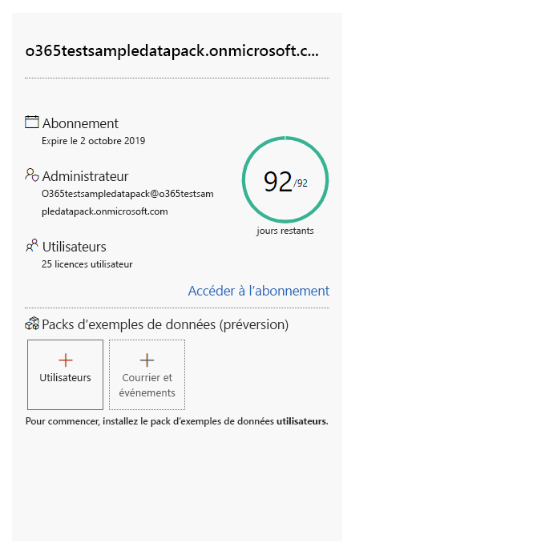
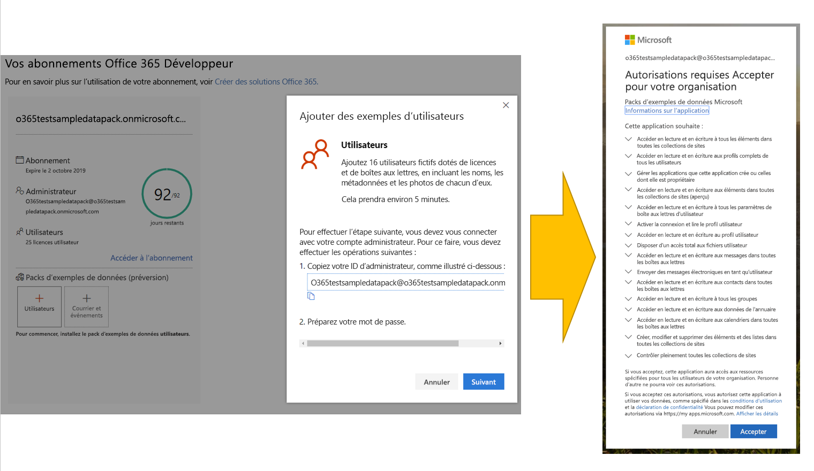
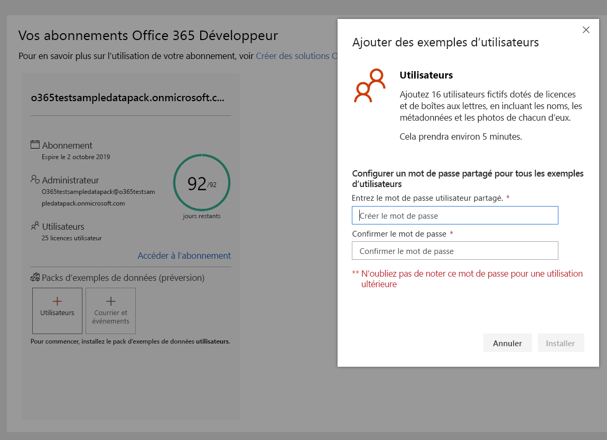
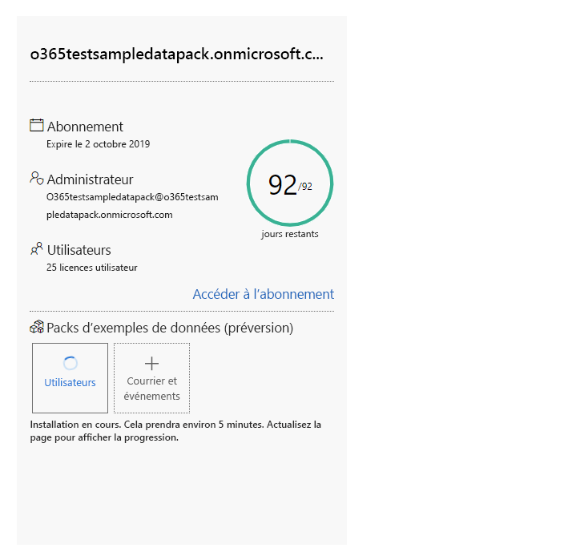
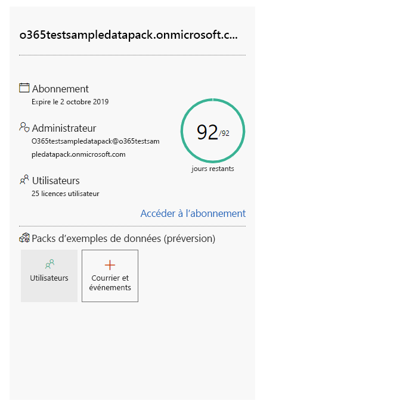
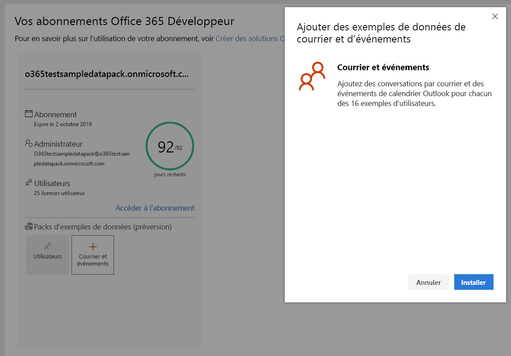

# Utiliser des packs d’exemples de données avec votre abonnement Office 365 Développeur

Vous pouvez installer des packs d’exemples de données sur votre abonnement Office 365 Développeur. Les packs d’exemples de données vous permettent de gagner du temps en installant automatiquement des données et le contenu nécessaire pour créer et tester vos solutions. Ceci inclut des utilisateurs, des métadonnées et des photos fictives pour simuler un petit environnement d’entreprise. Vous pouvez rapidement installer des exemples de données afin de pouvoir vous concentrer sur vos solutions plutôt que de consacrer du temps à créer des exemples de données vous-même.

Des packs d’exemples de données sont disponibles dans [le tableau de bord de votre programme Office 365 Développeur](https://developer.microsoft.com/office/profile), au bas de la vignette de votre abonnement Office 365.

Les packs d’exemples de données suivants sont actuellement disponibles :

- Utilisateurs : Installe 16 utilisateurs fictifs dotés de licences, de boîtes aux lettres et de métadonnées, en incluant les noms et les photos de chacun d’eux. Utilisez les API Microsoft Graph pour utiliser les exemples de données utilisateur de l’une des manières suivantes :
  - Obtenir des informations spécifiques sur un utilisateur
  - Mettre à jour un utilisateur
  - Obtenir des collaborateurs
  - Préparer l’organigramme  
  - Obtenir des utilisateurs par service

- Courrier et événements : Ajoute des conversations par courrier et des événements de calendrier Outlook pour chacun des 16 exemples d’utilisateurs. Utilisez les API Microsoft Graph pour utiliser les exemples de données de courriers et d’événements de l’une des manières suivantes :
  - Obtenir les courriers électroniques par utilisateurs
  - Obtenir les courriers électroniques filtrés par date
  - Obtenir les événements à venir
  - Mettre à jour/supprimer les événements à venir

> [!NOTE]
> Avant d’installer les applications Courrier et Événements, vous devez installer le pack d’exemples de données Utilisateurs.

## Qu’ajoutent les packs d’exemples de données ajoutés à mon abonnement Office 365 ?

Le pack d’exemples de données Utilisateurs crée 16 utilisateurs fictifs pour votre abonnement et inclut les licences pour chaque utilisateur, ainsi que les boîtes aux lettres, les noms, les métadonnées et les photos pour chacun d’entre eux.

Le pack d’exemples de données Courrier et Événements ajoute des conversations par courrier et des événements de calendrier Outlook pour chacun des 16 exemples d’utilisateurs.

## Comment installer le pack d’exemples de données Utilisateurs ?

Avant d’installer le pack d’exemples de données Utilisateurs, assurez-vous que vous disposez d’un abonnement Office 365 Développeur et que vous vous attribuez une licence en d’administrateur.

Pour installer le pack d’exemples de données Utilisateurs, procédez comme suit :

1. Cochez la case **Utilisateurs** au bas de la vignette de votre abonnement.
2. Copiez votre ID d’administrateur ; vous en aurez besoin pour vous connecter à votre abonnement.
3. Saisissez votre ID administrateur et votre mot de passe sur la page de connexion.
4. Accordez-vous les autorisations d’administrateur de votre abonnement Office 365 Développeur.

5. Configurez vos mots de passe pour tous les exemples d’utilisateurs. Vous aurez besoin d’un mot de passe partagé défini pour simplifier l’administration de tous vos utilisateurs fictifs.

6. Les données sont installées. L’installation devrait prendre environ 5 minutes.

7. Une fois l’installation terminée, vous recevez une notification par courrier électronique. La case de la vignette de votre abonnement devient verte. Vous pouvez désormais installer les packs d’exemples de données Courrier et Événements.

## Comment installer les packs d’exemples de données Courrier et Événements ?

Après avoir installé le pack d’exemples de données Utilisateurs, vous pouvez installer les courriers et les événements.

1. Cochez la case **Courrier &amp;Événements sur la vignette de votre abonnement.
2. Sélectionnez **Installer** pour commencer l’installation.

> [!NOTE]
> Si vous venez de créer votre abonnement, celui-ci doit être complètement configuré avant que l’installation puisse commencer. Cette étape peut prendre jusqu’à quelques heures. Une fois l’installation démarrée, l’opération peut prendre jusqu’à 20 minutes.

3. Une fois l’installation terminée, vous recevez une notification par courrier électronique. La case de la vignette de votre abonnement devient verte.

## Y aura-t-il d’autres packs d’exemples de données ?

Oui. Nous ajouterons des packs d’exemples de données pour SharePoint et OneDrive. Dans le futur, nous allons ajouter des packs d’exemples de données pour d’autres produits et technologies, notamment les compléments Office, Microsoft Teams, etc.

## Puis-je installer des packs d’exemples de données sur mes autres abonnements Office 365 ?

Non. Ces packs d’exemples de données sont uniquement compatibles avec l’abonnement Office 365 Développeur inclus dans le cadre du programme Office 365 Développeur.

## Voir aussi

- [Configurer un abonnement Office 365 Développeur](office-365-developer-program-get-started.md)
