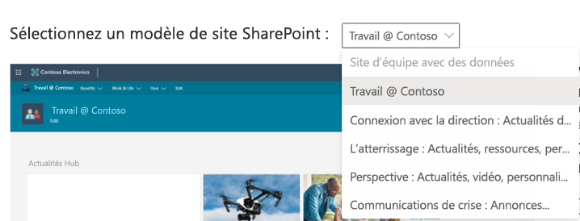

# Exemples de données de bac à sable pour les développeurs

Votre abonnement au bac à sable du Programme pour les développeurs Microsoft 365 est fourni avec des exemples de données pour vous faire gagner du temps en fournissant les données et le contenu dont vous avez besoin pour créer et tester vos solutions.

## Exemples de données installés sur le bac à sable instantané

Si vous avez un bac à sable instantané, les packs d’exemples de données sont déjà préinstallés. Votre bac à sable instantané inclut les exemples de données suivants :

- **Données de calendrier, de courrier et de l’utilisateur Microsoft Graph** : 16 exemples d’utilisateurs avec des données utilisateur et du contenu pour vous aider à modéliser vos solutions. Cela comprend les boîtes aux lettres des utilisateurs, les événements du calendrier et l'intégration dans un environnement pour développeurs Teams avec des conversations simulées et des appartenances à une équipe.
- Pack **d’exemple de données Teams** avec l’environnement pour développeurs personnalisé suivant :
  - **Chargement indépendant d’application** pré-configuré
  - **Cinq exemples d’équipes, de canaux, d’onglets et de sessions de conversation** créés autour des 16 exemples d’utilisateurs.
  - **App Studio /Portail des développeurs Teams préinstallé et épinglé** pour vous aider à simplifier la création de votre manifeste d’application et de votre package d’application Teams, ainsi que l’éditeur de cartes et une bibliothèque de contrôles React.
    
    
- **Exemple de données SharePoint Framework** : choisissez parmi six modèles de site que vous pouvez installer et évaluer en tant que solutions personnalisées pour votre organisation (avec un modèle préinstallé).

## Installer des packs d’exemple de données dans votre bac à sable configurable

Si vous avez un bac à sable configurable, vous pouvez rapidement installer les exemples de données afin de pouvoir vous concentrer sur vos solutions plutôt que de passer du temps à créer vous-même des exemples de données.

> [!NOTE] 
> Vous ne pouvez pas installer de packs d’exemple de données sur d’autres abonnements Microsoft 365. Ces packs d’exemple de données sont uniquement compatibles avec l’abonnement au bac à sable pour les développeurs Microsoft 365 que vous obtenez dans le cadre du programme pour les développeurs Microsoft 365.

Des packs d’exemples de données sont disponibles dans le [Tableau de bord de votre programme Microsoft 365 Développeur](https://developer.microsoft.com/microsoft-365/profile), au bas de la vignette de votre abonnement.

Les packs d’exemples de données suivants sont actuellement disponibles :

- Utilisateurs : Installe 16 utilisateurs fictifs dotés de licences, de boîtes aux lettres et de métadonnées, en incluant les noms et les photos de chacun d’eux. Utilisez les API Microsoft Graph pour utiliser les exemples de données utilisateur de l’une des manières suivantes :
  - Obtenir des informations spécifiques sur un utilisateur
  - Mettre à jour un utilisateur
  - Obtenir des collaborateurs
  - Préparer l’organigramme  
  - Obtenir des utilisateurs par service

- Courrier et événements : ajoute des conversations par courrier et des événements de calendrier Outlook pour chacun des 16 exemples d’utilisateurs. Utilisez les API Microsoft Graph pour utiliser les exemples de données de courriers et d’événements de l’une des manières suivantes :
  - Obtenir les courriers électroniques par utilisateurs
  - Obtenir les courriers électroniques filtrés par date
  - Obtenir les événements à venir
  - Mettre à jour/supprimer les événements à venir

  > [!NOTE]
  > Avant d’installer les applications Courrier et Événements, vous devez installer le pack d’exemples de données Utilisateurs.
    
- Exemple de données SharePoint Framework : choisissez parmi six modèles de site que vous pouvez installer et évaluer en tant que solutions personnalisées pour votre organisation (avec un modèle préinstallé).

### Installer le pack d’exemple de données Utilisateurs

Avant d’installer le pack d’exemples de données Utilisateurs, assurez-vous que vous disposez d’un abonnement Microsoft 365 Développeur et que vous vous attribuez une licence en d’administrateur.

> [!NOTE]
> Assurez-vous que 16 utilisateurs sont disponibles dans votre abonnement. Votre abonnement inclut 25 utilisateurs. Si vous avez déjà configuré plus de 10 utilisateurs, supprimez d’abord certains utilisateurs afin de vous assurer que l’installation réussit.

Pour installer le pack d’exemples de données Utilisateurs, procédez comme suit :

1. Cochez la case **Utilisateurs** au bas de la vignette de votre abonnement.
2. Copiez votre ID d’administrateur ; vous en aurez besoin pour vous connecter à votre abonnement.
3. Saisissez votre ID administrateur et votre mot de passe sur la page de connexion.
4. Accordez-vous les autorisations d’administrateur de votre abonnement Microsoft 365 Développeur.

  

5. Configurez vos mots de passe pour tous les échantillons d’utilisateurs. Vous devrez définir un mot de passe partagé pour faciliter l'administration de tous vos utilisateurs fictifs.

  

6. Les données sont installées. L’installation devrait prendre environ 5 minutes.

  

7. Une fois l’installation terminée, vous recevez une notification par courrier électronique. La case de la vignette de votre abonnement devient verte. Vous pouvez désormais installer les packs d’exemples de données Courrier et Événements.

  

### Installer le pack d’exemple de données Courrier et Événements

Après avoir installé le pack d’exemples de données Utilisateurs, vous pouvez installer les courriers et les événements.

1. Cochez la case **Courrier &amp;Événements** sur la vignette de votre abonnement.
2. Sélectionnez **Installer** pour commencer l’installation.

  

  > [!NOTE]
  > Si vous venez de créer votre abonnement, celui-ci doit être complètement configuré avant que l’installation puisse commencer. Cette étape peut prendre jusqu’à quelques heures. Une fois l’installation démarrée, l’opération peut prendre jusqu’à 20 minutes.

3. Une fois l’installation terminée, vous recevez une notification par courrier électronique. La case de la vignette de votre abonnement devient verte.

### Installer le pack d’exemple de données SharePoint

Le pack d’exemple de données SharePoint inclut six modèles de site SharePoint différents parmi lesquels choisir pour expérimenter et modéliser des solutions SharePoint pour la collaboration, la communication, l’engagement et la gestion des connaissances.

Voici quelques-uns des modèles les plus populaires du [look book SharePoint PnP](https://lookbook.microsoft.com). Aujourd’hui, il est facile de créer des exemples de solutions de sites et de pages magnifiques et d’accès rapide qui offriront une apparence remarquable sur tous les appareils ou écrans. Inspirez-vous de ces conceptions ou ajoutez-les à votre client bac à sable pour commencer à créer votre prochain site.

Vous pouvez installer les modèles lors de votre abonnement. Après installé un modèle, vous pouvez installer les autres. Le processus d’installation inclut les étapes suivantes :

1. Sélectionnez le modèle désiré dans le menu déroulant.

  

2. Configurez des options personnalisées de vos sites ou acceptez les valeurs par défaut.
3. Utilisez l’ID d’administrateur et le mot de passe de votre client bac à sable pour vous authentifier, puis accorder les autorisations d’installation. 

L’installation s’effectue automatiquement.

>**Remarque :** la mise en service de ces modèles de site fonctionne uniquement avec les abonnements anglais d’Office 365 E3 ou de Microsoft 365 E5 pour les développeurs, et tout le contenu inclus est uniquement en anglais.

#### Quels sont les modèles SharePoint disponibles ?

L’exemple de pack SharePoint inclut sept modèles différents.

#### Site d’équipe avec des données

Le modèle Site d’équipe avec des données comporte plusieurs listes et bibliothèques de documents automatiquement associées à un site d’équipe SharePoint qui vous permettent de développer des solutions à l’aide de SharePoint Framework, PowerApps et Microsoft Graph.

Ce modèle inclut les données suivantes :

- Liste de contacts préremplie
- Liste remplie de plus de 6 000 éléments
- Bibliothèques de documents avec des exemples de documents PowerPoint, Excel, Word et OneNote
- Liste d’événements avec des éléments d’annonces

Ce modèle s’intègre aux exemples de données Utilisateurs.

#### Work @ Contoso
Le modèle Work @ Contoso comporte plusieurs collections de sites qui sont toutes associées automatiquement au site hub pour montrer comment marchent toutes les fonctionnalités d’agrégation par défaut.

Ce modèle contient les structures et les éléments suivants :

- Collection de sites principale définie en tant que site hub
- Deux sites de communication d’associations caritatives associés au site hub
- Un site d’équipe de travail associé au site hub
- Des exemples d’articles d’actualités dans les collections de sous-sites
- Des exemples de fichiers Word, Excel et PowerPoint.
- Exemples d’images utilisés dans les collections de sites

Les collections de sous-sites utilisent les mêmes modèles que vous pouvez également configurer séparément depuis ce service.

>**Remarque :** si vous appliquez ce modèle sur un site de communication existant, cela remplace le contenu de la page d’accueil du site.

#### Connexion de Leadership : actualités de Leadership, événements, engagement

Ce site d’équipe de direction fournit des informations sur les objectifs et les priorités de l’équipe de direction, et stimule l’engagement grâce à des événements et des discussions.

L’ajout de cette conception à votre client crée le contenu suivant :

- Exemple de page d’accueil avec démonstration de composants WebPart
- Exemples d’articles d’actualités démontrant plusieurs conceptions de page modernes

Ce modèle s’intègre aux exemples de données Utilisateurs.

#### Accueil : actualités, ressources, contenu personnalisé

Nous avons conçu ce site de communication pour permettre à vos employés de trouver les informations et les ressources dont ils ont besoin, ainsi que du contenu personnalisé adapté à leurs besoins.

L’ajout de cette conception à votre client crée les contenus suivants :

- Une structure de démonstration pour le site d’accueil du portail
- Une structure de page d’accueil personnalisée
- Six autres exemples de pages modernes et d’articles d’actualités
- Des exemples d’images et de documents Office

#### Perspective : actualités, vidéo, contenu personnalisé

Conçu pour fournir des informations et des contenus personnalisés, ce site inclut également des vidéos pour renforcer l’engagement.
L’ajout de cette conception à votre client crée les contenus suivants :

- Des conceptions de page d’accueil personnalisées
- Un exemple de modèle de page pour les articles d’actualités
- 12 exemples d’articles d’actualités

#### Communications de crise : annonces, actualités, ressources, communautés et appels à l’action

Restez informé, engagé et progressez en cas de crises d’événements météorologiques extrêmes dans un état de santé et d’urgence. Ce modèle crée une ressource centralisée permettant aux leaders et aux communicateurs de partager des actualités et annonces importantes. Cette source unique de vérité permet aux gens de s’informer et constitue un lieu de connexion des membres de l’ensemble de l’organisation.

L’ajout de cette conception à votre client crée le contenu suivant :

- Page d’accueil personnalisée conçue à l’aide d’un composant WebPart
- Quatre articles d’actualités avec un exemple de contenu

Ce modèle s’intègre aux exemples de données Utilisateurs.

## Puis-je installer des packs d’exemples de données sur mes autres abonnements Microsoft 365 ?

Non. Ces exemples de packs de données sont uniquement compatibles avec l’abonnement Microsoft 365 développeur que vous obtenez dans le cadre du programme Microsoft 365 développeurs.

## Comment puis-je voir les exemples de données dans mon abonnement ?

Pour voir les exemples de données Utilisateurs, accédez au [**Centre d’administration Microsoft 365**](https://admin.microsoft.com/) sur votre abonnement Microsoft 365 Développeur. Sous **Utilisateurs**, sélectionnez **Utilisateurs actifs**. La liste qui apparaît contient les noms de 16 utilisateurs. Vous pouvez sélectionner un utilisateur pour afficher les métadonnées associées, notamment les photos et les licences.

Pour consulter les exemples de données Courrier et Événements, dans le [**Centre d’administration Microsoft 365**](/microsoft-365/admin/admin-overview/about-the-admin-center?view=o365-worldwide), sélectionnez **Afficher tout**, puis **Exchange**. Dans le Centre d’administration Exchange, lorsque vous sélectionnez **destinataires**, vous pouvez constater que des messages et des événements ont été ajoutés aux boîtes aux lettres de chacun des 16 utilisateurs.

Pour consulter les exemples de données Microsoft Teams, accédez à **Teams** dans votre abonnement Microsoft 365 E5. Sous l’onglet Teams, vous verrez des équipes pré-créées avec des conversations à partir d’exemples d’utilisateurs dans **Équipe du projet Mark 8**. L’application App Studio/Portail de développement est préinstallée et épinglée au volet de navigation.

Pour voir l’exemple de données SharePoint, accédez au Centre d’administration SharePoint, puis choisissez **Sites actifs** dans la navigation gauche. Vous pouvez voir les exemples de sites préinstallés et tous les modèles de site supplémentaires que vous installez dans votre bac à sable.

## Articles associés

- [Configurez un abonnement Microsoft 365 Développeur](microsoft-365-developer-program-get-started.md)
