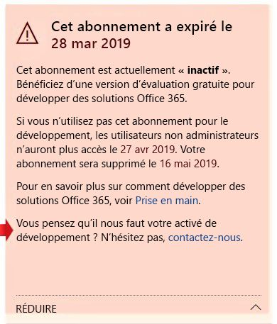

# FAQ sur le programme de développement Microsoft 365Microsoft 365 Developer Program FAQ

Voici les questions fréquemment posées concernant le programme pour les développeurs Microsoft 365.The following are frequently asked questions about the Microsoft 365 Developer Program.

## Qu’est-ce que le programme pour les développeurs Microsoft 365 et qui doit le rejoindre ?What is the Microsoft 365 Developer Program and who should join it?

Le programme Microsoft 365 pour développeurs est conçu pour vous aider à créer des expériences de productivité multiplateforme axées sur les personnes dans la continuité de Microsoft 365.The Microsoft 365 Developer Program is designed to help you build people-centric, cross-platform productivity experiences that extend Microsoft 365. Rejoignez notre programme pour accéder aux outils, documentation, formation, experts et événements de communauté dont vous avez besoin pour créer des solutions adaptées pour les produits et technologies Microsoft 365, notamment :Join our program to get access to the tools, documentation, training, experts, and community events that you need to build great solutions for Microsoft 365 products and technologies, including:

- Compléments web [Excel](https://developer.microsoft.com/excel), [Outlook](https://developer.microsoft.com/outlook), [Word](https://developer.microsoft.com/word), et [PowerPoint](https://developer.microsoft.com/powerpoint)[Excel](https://developer.microsoft.com/excel), [Outlook](https://developer.microsoft.com/outlook), [Word](https://developer.microsoft.com/word), and [PowerPoint](https://developer.microsoft.com/powerpoint) web add-ins
- [SharePointSharePoint](https://developer.microsoft.com/sharepoint)
- [Microsoft TeamsMicrosoft Teams](https://developer.microsoft.com/microsoft-teams)
- [Microsoft GraphMicrosoft Graph](https://developer.microsoft.com/graph)

En tant que membre du programme, vous pouvez obtenir un abonnement pour les développeurs Microsoft 365 gratuit avec 25 licences utilisateur à utiliser pour créer vos solutions.As a program member, you can get a free Microsoft 365 developer subscription with 25 user licenses to use to build your solutions. Cet abonnement restera actif tant que vous développez et déployez activement des solutions.This subscription will remain active for as long as you’re actively developing and deploying solutions.

Pour plus d’informations, reportez-vous à l’article [Rejoignez le programme pour les développeurs Microsoft 365](microsoft-365-developer-program.md)et [Créez des solutions Microsoft 365](build-microsoft-365-solutions.md).For more information, see [Join the Microsoft 365 Developer Program](microsoft-365-developer-program.md) and [Build Microsoft 365 solutions](build-microsoft-365-solutions.md).

## Quel compte puis-je utiliser pour m’inscrire au programme Microsoft 365 pour les développeurs ?What account can I use to sign up for the Microsoft 365 Developer Program?

Vous pouvez vous inscrire au programme pour les développeurs à l’aide d’un des types de comptes suivants :You can sign up for the developer program by using one of the following account types:

- **Compte Microsoft** (créé par vous pour une utilisation personnelle) : fournit un accès à tous les services cloud et produits Microsoft destinés aux consommateurs, tels que Outlook (Hotmail), Messenger, OneDrive, MSN, Xbox Live ou Microsoft 365.**Microsoft account** (created by you for personal use) - Provides access to all consumer-oriented Microsoft products and cloud services, such as Outlook (Hotmail), Messenger, OneDrive, MSN, Xbox Live, or Microsoft 365. Toute inscription à une boîte aux lettres Outlook.com crée automatiquement un compte Microsoft.Signing up for an Outlook.com mailbox automatically creates a Microsoft account. Une fois le compte Microsoft créé, celui-ci peut être utilisé pour accéder aux services de cloud computing Microsoft liés aux consommateurs ou à Azure.After a Microsoft account is created, it can be used to access consumer-related Microsoft cloud services or Azure. 
- **Compte professionnel** (émis par un administrateur pour une utilisation professionnelle) : fournit un accès à tous les services de cloud computing Microsoft aux petites, moyennes et grandes entreprises, tels qu’Azure, Microsoft Intune ou Microsoft 365.**Work account** (issued by an admin for business use) - Provides access to all small, medium, and enterprise business-level Microsoft cloud services, such as Azure, Microsoft Intune, or Microsoft 365. Lorsque vous vous inscrivez à l’un de ces services en tant qu’organisation, un répertoire informatique est automatiquement configuré dans Azure Active Directory pour représenter votre organisation.When you sign up to one of these services as an organization, a cloud-based directory is automatically provisioned in Azure Active Directory to represent your organization. Pour plus d’informations, reportez-vous à l’article [Gérer votre répertoire Azure AD](/azure/active-directory/active-directory-administer).For more information, see [Manage your Azure AD directory](/azure/active-directory/active-directory-administer).
- **Visual Studio ID** (créé pour vos abonnements Visual Studio Professional ou entreprise) : nous vous recommandons d’utiliser cette option pour rejoindre le programme développeur à partir de la galerie Visual Studio pour profiter des avantages en tant qu’abonné Visual Studio.**Visual Studio ID** (created for your Visual Studio Professional or Enterprise subscriptions) - We recommend that you use this option to join the developer program from within the Visual Studio Gallery to get the full benefits as a Visual Studio subscriber. 

## Comment obtenir un abonnement Microsoft 365 Développeur via le programme pour les développeurs ?How can I get a Microsoft 365 developer subscription via the Developer Program?  

Vous pouvez obtenir un abonnement Microsoft 365 Développeur gratuit lorsque vous rejoignez le programme Microsoft 365 E5 Développeur.When you join the Microsoft 365 Developer Program, you qualify to get a free Microsoft 365 E5 developer subscription. Cet abonnement spécial est conçu pour être utilisé uniquement pour le développement.This is a special subscription designed to be used for application development only. Pour plus d’informations, reportez-vous à l’article [Configuration d’un abonnement Microsoft 365 Développeur](microsoft-365-developer-program-get-started.md).For more information, see [Set up a Microsoft 365 developer subscription](microsoft-365-developer-program-get-started.md).

## Quel ID dois-je utiliser pour me connecter au tableau de bord du programme développeur ?What ID do I use to sign in to the Developer Program dashboard?

Utilisez votre ID de membre pour vous connecter au tableau de bord du programme développeur afin d’accéder aux informations relatives à votre abonnement.Use your member ID to sign in to the Developer Program dashboard to access information about your subscription. Il s’agit du compte Microsoft ou du courrier Azure Active Directory que vous avez utilisé pour vous connecter lorsque vous avez rejoint le programme.This is the Microsoft account or Azure Active Directory-enabled email that you used to sign in when you joined the program.

## Quel ID dois-je utiliser pour me connecter à mon abonnement développeur ?What ID do I use to sign in to my developer subscription?

Utilisez l’ID d’administrateur que vous avez créé lors de la configuration de votre abonnement développeur.Use the administrator ID that you created when you set up your developer subscription. Vous trouverez votre ID d’administrateur sur la vignette de l’abonnement sur le [tableau de bord du programme développeur](https://aka.ms/DevProgramDashboard).You can find your administrator ID on the subscription tile on the [Developer Program dashboard](https://aka.ms/DevProgramDashboard).

## Qu’est-ce qu’inclut l’abonnement développeur ?What's included in the developer subscription?

Si vous avez créé votre abonnement après le 25 août 2019, vous disposez d’un abonnement Microsoft 365 E5 Développeur avec 25 licences utilisateur.If you created your subscription after August 25, 2019, you have a Microsoft 365 E5 Developer subscription with 25 user licenses. Les clients qui ont rejoint le programme avant le 25 août 2019 disposent d’un abonnement Office 365 E3 Développeur avec 25 licences utilisateur.Customers who joined the program before August 25, 2019, have an Office 365 E3 Developer subscription with 25 user licenses.

L’abonnement Office 365 E3 Développeur inclut les éléments suivants :The Office 365 E3 Developer subscription includes the following:

- [Exchange Online (Plan 2)Exchange Online (Plan 2)](https://products.office.com/exchange/compare-microsoft-exchange-online-plans)
- [Flow pour Office 365Flow for Office 365](https://flow.microsoft.com/pricing/)
- [Protection des informations pour Office 365 – StandardInformation Protection for Office 365 - Standard](https://products.office.com/fr-FR/business/azure-information-protection-for-office-365)
- [Microsoft Forms (Plan E5)Microsoft Forms (Plan E5)](https://support.office.com/article/Frequently-asked-questions-about-Microsoft-Forms-495c4242-6102-40a0-add8-df05ed6af61c)
- [Planificateur MicrosoftMicrosoft Planner](https://products.office.com/compare-all-microsoft-office-products?tab=2)
- 
  [Recherche Microsoft](https://products.office.com/en-us/business/intelligent-search?tab=Discovery)[Microsoft Search](https://products.office.com/en-us/business/intelligent-search?tab=Discovery)
- [Microsoft Stream pour Office 365 E5Microsoft Stream for Office 365 E5 SKU](https://products.office.com/business/office-365-enterprise-e5-business-software)
- [Microsoft TeamsMicrosoft Teams](https://products.office.com/business/office-365-enterprise-e5-business-software)
- [Gestion des appareils mobiles pour Office 365Mobile Device Management for Office 365](https://support.office.com/article/Set-up-Mobile-Device-Management-MDM-in-Office-365-dd892318-bc44-4eb1-af00-9db5430be3cd)
- [Office 365 ProPlusOffice 365 ProPlus](https://products.office.com/business/office-365-proplus-business-software)
- [Office pour le webOffice for the web](/office365/servicedescriptions/office-online-service-description/office-online-service-description)
- [PowerApps pour Office 365PowerApps for Office 365](https://powerapps.microsoft.com/pricing/)
- [SharePoint Online pour les développeursSharePoint Online for Developer](https://products.office.com/SharePoint/compare-sharepoint-plans)
- [Skype Entreprise Online (Plan 2)Skype for Business Online (Plan 2)](https://products.office.com/skype-for-business/online-meeting-solutions)
- [SwaySway](https://sway.com/)
- [To-Do (Plan 3)To-Do (Plan 3)](https://todo.microsoft.com)
- [Tableau blanc (Plan 2)Whiteboard (Plan 2)](https://products.office.com/fr-FR/microsoft-whiteboard/digital-whiteboard-app)

L’abonnement Microsoft 365 E5 Développeur inclus toutes les applications comprises dans l’abonnement Office 365 E3 Développeur, ainsi que les nouvelles fonctionnalités suivantes :The Microsoft 365 E5 Developer subscription includes all the apps that are included in the Office 365 E3 Developer subscription, plus the following new features:  

- Fonctionnalités d’analyse avancées avec Power BIAdvanced analytics with Power BI  
- Enterprise Mobility + Security (EMS) pour la protection de la conformité et des informationsEnterprise Mobility + Security (EMS) for compliance and information protection  
- Office 365 – Protection avancée contre les menacesOffice 365 Advanced Threat Protection 
- Azure Active Directory pour la création de solutions avancées de gestion d’identité et d’accèsAzure Active Directory for building advanced identity and access management solutions  

L’abonnement Microsoft 365 E5 Développeur inclut les éléments suivants :The Microsoft 365 E5 Developer subscription includes the following: 

- Azure Active Directory Premium P1Azure Active Directory Premium P1 
- Azure Active Directory Premium P2Azure Active Directory Premium P2 
-   Azure Advanced Threat ProtectionAzure Advanced Threat Protection 
-   Azure Information Protection Premium P1Azure Information Protection Premium P1 
-   Azure Information Protection Premium P2Azure Information Protection Premium P2 
-   Référentiel sécurisé clientCustomer Lockbox 
-   Exchange Online (plan 2)Exchange Online (Plan 2) 
-   Flow pour Office 365Flow for Office 365 
-   Protection des informations pour Office 365 – PremiumInformation Protection for Office 365 - Premium 
-   Protection des informations pour Office 365 – StandardInformation Protection for Office 365 - Standard 
-   Microsoft Azure Active Directory RightsMicrosoft Azure Active Directory Rights 
-   Microsoft Azure Multi-Factor AuthenticationMicrosoft Azure Multi-Factor Authentication 
-   Microsoft Cloud App SecurityMicrosoft Cloud App Security 
-   Microsoft Forms (plan E5)Microsoft Forms (Plan E5) 
-   Microsoft IntuneMicrosoft Intune 
-   Microsoft MyAnalytics (complet)Microsoft MyAnalytics (Full) 
-   Microsoft PlannerMicrosoft Planner 
-   Microsoft StaffHubMicrosoft StaffHub 
-   Microsoft Stream pour O365 E5 SKUMicrosoft Stream for O365 E5 SKU 
-   Microsoft TeamsMicrosoft Teams 
-   Gestion des appareils mobiles pour Office 365Mobile Device Management for Office 365 
-   Office 365 Advanced eDiscoveryOffice 365 Advanced eDiscovery 
-   Gestion de la sécurité avancée Office 365Office 365 Advanced Security Management 
-   Office 365 – Protection avancée contre les menaces (plan 1)Office 365 Advanced Threat Protection (Plan 1) 
-   Office 365 – Protection avancée contre les menaces (plan 2)Office 365 Advanced Threat Protection (Plan 2) 
-   Office 365 Privileged Access ManagementOffice 365 Privileged Access Management 
-   Office 365 ProPlusOffice 365 ProPlus 
-   Office OnlineOffice Online 
-   Système téléphoniquePhone System 
-   Power BI ProPower BI Pro 
-   PowerApps pour Office 365 Plan 3PowerApps for Office 365 Plan 3 
-   SharePoint Online (plan 2)SharePoint Online (Plan 2) 
-   Skype Entreprise Online (plan 2)Skype for Business Online (Plan 2) 
-   SwaySway 
-   Tâches (plan 3)To-Do (Plan 3) 
-   Tableau blanc (plan 3)Whiteboard (Plan 3) 
-   Yammer EntrepriseYammer Enterprise 

Vous pouvez déterminer si vous avez un abonnement Microsoft 365 E5 ou un abonnement Office 365 E3 sur la vignette de l’abonnement sur votre [tableau de bord](https://developer.microsoft.com/office/profile).You can determine whether you have a Microsoft 365 E5 subscription or an Office 365 E3 subscription on the subscription tile on your [dashboard](https://developer.microsoft.com/office/profile). La vignette affiche E3 ou E5 sous le nom de domaine de l’abonnement.The tile will show either E3 or E5 under the subscription domain name.

..

## L’abonnement inclut-il également un abonnement à Azure ?Does the subscription also include a subscription to Azure?

Cette offre n’inclut pas d’un abonnement à Azure.This offer does not include a subscription to Azure. Toutefois, pour obtenir un accès gratuit aux services Azure, vous pouvez [créer un compte Azure gratuit](https://azure.microsoft.com/free/).However, to receive free access to Azure services, you can [create a free Azure account](https://azure.microsoft.com/free/). 

## Combien de licences utilisateur l'abonnement Développeur comprend-il ?How many user licenses does the developer subscription include?

Dans le cadre de votre abonnement Office 365 E3 ou Microsoft 365 E5 Développeur, vous pouvez ajouter jusqu'à 25 licences utilisateur, y compris l’administrateur, uniquement à des fins de développement.Your Office 365 E3 or Microsoft 365 E5 developer subscription includes 25 user licenses, including the administrator, for development purposes only. L’utilisation de cet abonnement pour toute fin autre que celle de développement d’applications est une violation du contrat de licence.Using this subscription for any purpose other than application development is a violation of the license agreement. Pour plus d’informations sur les restrictions de licences, voir les [Conditions d’utilisation](terms-and-conditions.md).For more details about the licensing restrictions, see the [terms of use](terms-and-conditions.md).

## Quelle est la durée de mon abonnement et quand expire-t-il ?How long is my subscription good for, and when does it expire?

Votre abonnement est valable 90 jours et est renouvelable en fonction de l’activité développeur valide.Your subscription is good for 90 days and is renewable based on valid developer activity. Si vous utilisez votre abonnement pour le développement, il sera renouvelé tous les 3 mois et fonctionnera indéfiniment.If you're using your subscription for development, it will be renewed every 3 months and will last indefinitely. Vous pouvez trouver la date d’expiration, ainsi que votre nom d’abonnement, sur le [tableau de bord du programme pour les développeurs Microsoft 365](https://aka.ms/DevProgramDashboard).You can find the expiration date, along with your subscription name, on your [Microsoft 365 Developer Program dashboard](https://aka.ms/DevProgramDashboard). Pour plus d’informations, voir [Expiration de l’abonnement et renouvellement](subscription-expiration-and-renewal.md).For more information, see [Subscription expiration and renewal](subscription-expiration-and-renewal.md).

Si vous rejoignez le programme via Visual Studio Enterprise ou Visual Studio Professionnel, votre abonnement est renouvelé automatiquement jusqu'à l’expiration de votre abonnement Visual Studio.If you're joining the program through Visual Studio Enterprise or Visual Studio Professional, your subscription is automatically renewed until your Visual Studio subscription expires. 

## Pourquoi ne proposez-vous pas d’abonnement d’un an ?Why don’t you offer a one-year subscription?

En avril 2019, nous sommes passés à un nouveau modèle dans lequel votre abonnement peut être renouvelé perpétuellement tous les 90 jours si vous l’utilisez activement pour le développement.In April 2019, we transitioned to a new model where your subscription can be renewed perpetually every 90 days if you're actively using it for development. Nous sommes convaincus que ce modèle garantit que les développeurs participant activement au développement de solutions ont un abonnement aussi longtemps qu’ils en ont besoin.We believe that this model ensures that developers who are actively developing solutions have a subscription for as long as they need one. Si vous développez fréquemment, votre abonnement n’expire jamais ; il se renouvelle automatiquement.If you're developing frequently, your subscription never expires; it is automatically extended. Si vous développez pendant une courte période, et que votre abonnement arrive à expiration et est supprimé, vous pouvez vous réinscrire pour un nouveau.If you're developing for a short time, and your subscription expires and is deleted, you can sign up for a new one. 

Si vous préférez disposer d’un abonnement qui est disponible pour une plus longue période, nous vous recommandons de souscrire à l’abonnement Visual Studio Professional ou Visual Studio Enterprise.If you prefer to have a subscription that is available for a longer time, we recommend that you get the Visual Studio Professional or Visual Studio Enterprise subscription. Ces programmes incluent un abonnement gratuit à Microsoft 365 pour les développeurs valable pour la durée de votre abonnement Visual Studio.These programs include a free Microsoft 365 developer subscription that is good for the life of your Visual Studio subscription. Pour accéder à cela, allez à [Visual Studio | Mes avantages](https://my.visualstudio.com/benefits).To access this, go to [Visual Studio | My Benefits](https://my.visualstudio.com/benefits). Pour plus d’informations, contactez le [Service clientèle Visual Studio](https://www.visualstudio.com/subscriptions/support/).For more information, contact [Visual Studio customer service](https://www.visualstudio.com/subscriptions/support/). 

## Comment déterminer si un abonnement peut être renouvelé ?How do you determine whether a subscription can be renewed?

Nous utilisons un ensemble d’algorithmes et télémétrie à partir de votre activité dans le programme Microsoft 365 pour les développeurs et depuis votre abonnement pour les développeurs Office 365 E3 ou Microsoft 365 E5 pour déterminer si vous développez activement.We use a set of algorithms and telemetry that we get from your activity in the Microsoft 365 Developer Program and on your Office 365 E3 or Microsoft 365 E5 developer subscription to determine whether you are actively developing. Nous vérifions ces données régulièrement pour mettre à jour votre état et déterminer si votre abonnement doit être prolongé.We check these regularly to update your status and determine whether your subscription should be extended. 

Si vous pensez que nous avons fait une erreur sur le suivi de votre activité de développement, vous pouvez nous en faire part via votre tableau de bord.If you think we somehow missed tracking your development activity accurately, you can let us know via your dashboard. Pour envoyer un formulaire qui nous informe comment vous utilisez votre abonnement pour le développement, dans l’avertissement de tableau de bord, sélectionnez le lien **faites-nous savoir**, comme illustré dans l’image suivante.To submit a form that tells us how you are using your subscription for development, in the dashboard warning, choose the **Let us know** link, as shown in the following image. Nous examinerons votre demande et vous indiquerons si vous êtes éligible pour une extension.We will review your request and let you know if you qualify for an extension. 

 

## Comment définissez-vous l’activité de développement ?How do you define development activity?

Votre activité dans le programme pour les développeurs et votre abonnement pour les développeurs déterminent si vous développez activement et si votre abonnement doit être prolongé.Your activity in the Developer Program and on your developer subscription determine whether you are actively developing and whether your subscription should be extended. 

Pour plus d’informations sur les types d’activités que nous suivons, voir les [Conditions d’utilisation](terms-and-conditions.md).For more information about the types of activities that we track, see the [terms of use](terms-and-conditions.md). 

## Lorsque mon abonnement est sur le point d’expirer, puis-je le prolonger ?When my subscription is about to expire, can I extend it?

La seule manière de prolonger votre abonnement est de maintenir une activité de développeur valide.The only way that you can extend your subscription is to do valid developer activity. Si vous utilisez votre abonnement pour développer des solutions personnalisées, votre abonnement expirera et finira par être supprimé.If you're using your subscription to develop custom solutions, your subscription will expire and will eventually be deleted. 

Pour plus d’informations, voir [expiration de l’abonnement et renouvellement](subscription-expiration-and-renewal.md).For more information, see [Subscription expiration and renewal](subscription-expiration-and-renewal.md).

## Si mon abonnement est sur le point d’expirer, combien de temps ai-je avant sa suppression ?If my subscription is going to expire, how much time do I have before it is deleted?

Vous disposez de 30 jours après l’expiration de votre abonnement pour migrer des données.You have 30 days after your subscription expires to migrate any data. Pendant ces 30 jours, seul l’administrateur a accès à l’abonnement et le 60ème jour, l’abonnement et toutes les données sont supprimés.For the next 30 days, only the admin will have access to the subscription, and on day 60, the subscription and all data will be deleted.

## Comment effectuer une migration à partir d’un abonnement Office 365 E3 vers un abonnement Microsoft 365 E5 ?How can I migrate from an Office 365 E3 subscription to a Microsoft 365 E5 subscription?

Pour l’instant, seuls les nouveaux membres du programme Microsoft 365 Développeur reçoivent automatiquement un abonnement Microsoft 365 E5 Développeur.Currently, only new Microsoft 365 Developer Program members will get a Microsoft 365 E5 Developer subscription automatically. Les utilisateurs existants pourront effectuer une migration vers un abonnement Microsoft 365 E5 à l’avenir.Existing users will be offered a way to migrate to a Microsoft 365 E5 subscription in the future. Ne vous inquiétez pas, nous mettons tout en œuvre pour permettre à tous les membres du programme Office 365 Développeur de migrer vers Microsoft 365 E5.Rest assured, we are working to enable all Office 365 Developer Program members to migrate to Microsoft 365 E5. 

## Ai-je le choix entre un abonnement Office 365 E3 ou Microsoft 365 E5 ?Can I choose whether to have an Office 365 E3 or a Microsoft 365 E5 subscription?

Pour l’instant, seuls les nouveaux membres du programme développeur sont invités à utiliser un abonnement Microsoft 365 E5.Currently, only new Developer Program members are offered a Microsoft 365 E5 subscription. Les membres existants disposant d’un abonnement Office 365 E3 pourront conserver leur abonnement actuel, puis continuer à le renouveler s’ils n’ont pas besoin des nouvelles fonctionnalités offertes par Microsoft 365 E5.Existing members with an Office 365 E3 subscription will have the option to keep their current subscription and continue to renew it if they don't need the new capabilities offered in Microsoft 365 E5. Les membres du programme développeur ne peuvent avoir qu’un seul abonnement.Developer program members can only have one subscription.  

Lorsqu’une migration sera possible pour les membres actuels du programme développeur, nous fournirons davantage d’informations sur le processus de migration.When we have a migration option for existing Developer Program members, we’ll provide more information about how to migrate. 

## En tant que partenaire Microsoft, puis-je bénéficier d’un abonnement ?As a Microsoft Partner, can I receive a subscription? 

Oui, vous pouvez suivre [ces instructions](microsoft-365-developer-program.md) pour rejoindre le programme pour les développeurs Microsoft 365 et configurer un abonnement Microsoft 365 Développeur.Yes, you can follow [these instructions](microsoft-365-developer-program.md) to join the Microsoft 365 Developer Program and set up a Microsoft 365 developer subscription. Toutefois, si vous disposez déjà d’un abonnement Visual Studio Enterprise ou Visual Studio Professional, vous pouvez obtenir un abonnement Microsoft 365 pour les développeurs comme bénéfice.However, if you already have a Visual Studio Enterprise or Visual Studio Professional subscription, you can get a Microsoft 365 developer subscription as a benefit. Pour accéder à cela, allez à [Visual Studio | Mes avantages](https://my.visualstudio.com/benefits).To access this, go to [Visual Studio | My Benefits](https://my.visualstudio.com/benefits). Pour plus d’informations, contactez le [Service clientèle Visual Studio](https://www.visualstudio.com/subscriptions/support/).For more information, contact [Visual Studio customer service](https://www.visualstudio.com/subscriptions/support/). 

## En tant qu’employé à plein temps de Microsoft, puis-je bénéficier d’un abonnement ?As a full-time Microsoft employee, can I receive a subscription?

Les employés de Microsoft ne peuvent pas s’inscrire à cette offre.Microsoft employees cannot sign up for this offer. Tous les employés à plein temps de Microsoft ont accès à un abonnement Visual Studio gratuit qui inclut l’accès à un abonnement Microsoft 365 E5 pour les développeurs.All Microsoft full-time employees have access to a free Visual Studio subscription that includes access to a Microsoft 365 E5 developer subscription. Vous pouvez accéder à cet avantage dans [Visual Studio | Mes avantages](https://my.visualstudio.com/benefits).You can access this benefit at [Visual Studio | My Benefits](https://my.visualstudio.com/benefits).

## En tant que fournisseur travaillant chez Microsoft, puis-je bénéficier d’un abonnement ?As a vendor working at Microsoft, do I qualify for a subscription?

Oui, vous pouvez suivre [ces instructions](microsoft-365-developer-program.md) pour rejoindre le programme pour les développeurs Microsoft 365 et configurer un abonnement Microsoft 365 Développeur.Yes, you can follow [these instructions](microsoft-365-developer-program.md) to join the Microsoft 365 Developer Program and set up a Microsoft 365 developer subscription. Mais même pour les fournisseurs, cet abonnement est conçu pour être utilisé _uniquement pour le développement d’applications_.But even for vendors, this subscription is designed to be used _for application development only_. Si vous n’effectuez pas d’activité de développement valide, votre abonnement ne sera pas renouvelé.If you are not doing valid development activity, your subscription will not be renewed.

## Le programme Microsoft 365 Développeur est-il disponible dans ma langue ?Is the Microsoft 365 Developer Program available in my language?

En plus de l’anglais, le programme Microsoft 365 pour les développeurs est disponible dans les langues suivantes : chinois (simplifié), français, allemand, japonais, portugais (Brésil), russe et espagnol.In addition to English, the Microsoft 365 Developer Program is available in the following languages: Chinese (Simplified), French, German, Japanese, Portuguese (Brazil), Russian, and Spanish.

## L’abonnement Microsoft 365 Développeur est-il disponible dans ma langue ?Is the Microsoft 365 developer subscription available in my language?

L’abonnement pour les développeurs Microsoft 365 est proposé uniquement en anglais.The Microsoft 365 developer subscription is only offered in English.

## Comment puis-je quitter le programme développeur de Microsoft 365 ?How do I leave the Microsoft 365 Developer Program?

Si vous ne souhaitez plus participer au programme pour les développeurs Microsoft 365, vous pouvez mettre fin à votre abonnement et quitter le programme.If you decide that you no longer want to participate in the Microsoft 365 Developer Program, you can end your subscription and leave the program.

  > [!WARNING]
  > Les étapes suivantes effaceront toutes vos informations de profil.The following steps will erase all of your profile information. Vous perdrez toutes les données stockées dans votre abonnement développeur qui ne sont pas sauvegardées ailleurs.You will lose any data stored in your developer subscription that is not backed up elsewhere.

1. Connectez-vous au programme pour les développeurs Microsoft 365 !Sign in to the Microsoft 365 Developer Program.

2. Choisissez **Supprimer le profil**.Choose **Delete Profile**.

3. Dans la zone de confirmation **Supprimer le profil**, sélectionnez **Supprimer**.In the **Delete Profile** confirmation box, choose **Delete**.

## SupportSupport

Si vous rencontrez des problèmes lors de la configuration de votre abonnement, consultez les ressources d’assistance suivantes :If you have issues setting up your subscription, see the following support resources:

- [Stack OverflowStack Overflow](https://stackoverflow.com/questions)   
- [Service clientèle Visual StudioVisual Studio customer service](https://www.visualstudio.com/subscriptions/support/)

## Articles associésSee also

- [Rejoignez le programme développeur de Microsoft 365Join the Microsoft 365 Developer Program](microsoft-365-developer-program.md)
- [Configurez un abonnement Microsoft 365 DéveloppeurSet up a Microsoft 365 developer subscription](microsoft-365-developer-program-get-started.md)
- [Utilisez votre abonnement pour créer des solutions Microsoft 365Use your subscription to build Microsoft 365 solutions](build-microsoft-365-solutions.md)
- [Renouveler un abonnement arrivant à expirationRenew an expiring subscription](subscription-expiration-and-renewal.md)

 

 

 

 

 

 
