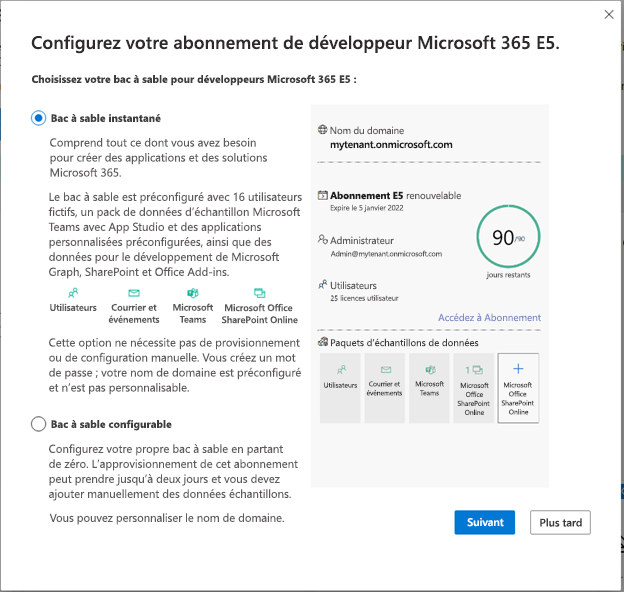

# Configurer un abonnement bac à sable Microsoft 365 

Configurez un bac à sable pour développeurs Microsoft 365 pour créer vos solutions indépendamment de votre environnement de production. L’appartenance à votre programme de développement, que vous rejoignez en tant que membre régulier ou via Visual Studio entreprise, inclut un abonnement bac à sable pour développeurs Microsoft 365 E5 avec 25 licences utilisateur. Il est valable 90 jours et est gratuit pour une utilisation à des fins de développement uniquement (solutions d’encodage). 

> [!NOTE] 
> Pour configurer un abonnement, vous devez d’abord [rejoindre le programme de développement Microsoft 365](microsoft-365-developer-program.md) directement ou via Visual Studio Professional ou Enterprise (si vous êtes abonné). Dès que vous avez adhéré au programme, l’option de configuration d’un abonnement s’affiche.

Vous pouvez choisir de configurer un bac à sable instantané ou un bac à sable configurable.

## Bac à sable instantané

Si vous choisissez un bac à sable instantané, vous pouvez réduire le temps de configuration de votre bac à sable de plusieurs jours à quelques secondes. Le bac à sable instantané Microsoft 365 est fourni avec Microsoft Teams, SharePoint, Outlook et Office. Il comprend également des licences pour 24 utilisateurs de test et un administrateur, ainsi que les dernières applications Microsoft 365 pour votre PC et votre Mac, notamment Power Apps, Power BI, Enterprise Mobility + Security, Office 365 Advanced Threat Protection et Azure Active Directory.

En outre, vous obtenez des exemples de données préinstallés, notamment le nouveau pack d’exemples de données Teams, ainsi que Microsoft Graph données utilisateur, de messagerie et de calendrier, ainsi que des exemples de données SharePoint Framework, qui simulent un petit environnement d’entreprise pour vous aider à créer des solutions sur la plateforme Microsoft 365. Pour plus d’informations, consultez Exemples de données de bac à sable développeur.

> [!VIDEO https://www.microsoft.com/en-us/videoplayer/embed/RWOmCY]

Vous ne pouvez pas personnaliser votre nom de domaine si vous choisissez cette option.

## Bac à sable configurable

Si vous choisissez un bac à sable configurable, vous pouvez personnaliser votre nom de domaine. Vous disposerez d’un bac à sable vide que vous devez remplir avec des exemples de données. L’approvisionnement de ce bac à sable peut prendre jusqu’à deux jours. Vous pouvez choisir d’installer les exemples de packs de données un par un disponibles dans le tableau de bord de votre programme de développement. Pour plus d’informations, consultez Exemples de données de bac à sable développeur.

## Configurer votre abonnement bac à sable Microsoft 365 E5

Pour obtenir un abonnement développeur Microsoft 365 :

1. Dans la page de votre profil, choisissez **Configurer l’abonnement E5**.

2. Dans la boîte de dialogue **Configurer votre abonnement développeur Microsoft 365 E5**, choisissez si vous souhaitez un bac à sable instantané ou un bac à sable configurable, puis choisissez **Suivant**.

    

Si vous avez sélectionné un bac à sable instantané :

1.  Choisissez le **Pays/région pour votre centre de données**, et fournissez un **Nom d’utilisateur d’administrateur** et **Mot de passe d’administrateur**, et éventuellement un autre mot de passe pour vos utilisateurs fictifs, puis choisissez **Continuer**.

    > [!IMPORTANT] 
    > Notez votre nom d’utilisateur et votre mot de passe, car vous en aurez besoin pour accéder à votre abonnement Développeur.

2.  Indiquez un numéro de téléphone portable valide et choisissez **Envoyer le code**. Entrez le code que vous recevez, puis choisissez **Configurer**.

    > [!NOTE] 
    > Vous devez utiliser un numéro de téléphone portable valide et non un numéro VoIP (Voice over IP).

3.  Une fois l’abonnement créé, le nom de domaine et la date d’expiration de votre abonnement apparaissent sur la page de votre profil.

Si vous avez sélectionné un bac à sable configurable :

1.  Choisissez votre **Pays/région**, puis indiquez un nom d’utilisateur dans le champ **Créer un nom d’utilisateur** et un nom de domaine dans le champ **Créer un domaine**. Créez et confirmez votre mot de passe, puis choisissez **Continuer**.

    > [!IMPORTANT] 
    > Notez votre nom d’utilisateur et votre mot de passe, car vous en aurez besoin pour accéder à votre abonnement Développeur.

2.  Indiquez un numéro de téléphone portable valide et choisissez **Envoyer le code**. Entrez le code que vous recevez, puis choisissez **Configurer**.
3.  Une fois l’abonnement créé, le nom de domaine et la date d’expiration de votre abonnement apparaissent sur la page de votre profil.

## Configuration de l’abonnement

1. Sur votre page de profil, choisissez **Accéder à l'abonnement** et connectez-vous avec votre identifiant utilisateur (par exemple, nomutilisateur@domaine.onmicrosoft.com) et le mot de passe que vous avez indiqués pour votre abonnement Développeur.

   > [!NOTE] 
   > Ne vous connectez pas à votre abonnement avec votre ID de compte de programme pour les développeurs.

2. Utilisez le lanceur d’applications pour accéder au [Centre d’administration](https://admin.microsoft.com/AdminPortal/Home#/homepage).

3. Dans la page d’accueil du Centre d’administration, choisissez **Accéder à la configuration guidée**. Cela vous permet d’accéder à la page **Configuration de Microsoft 365 E5 Développeur**.

4. **Installez vos applications Office**. Vous avez la possibilité d’installer des applications Office sur votre ordinateur. Lorsque vous êtes prêt, choisissez **Continuer**.

5. **Personnalisez votre connexion et votre e-mail**. Vous pouvez connecter votre abonnement à un domaine ou simplement utiliser le sous-domaine existant que vous avez créé. Lorsque vous êtes prêt, choisissez **Utiliser ce domaine** ou **Faites-le ultérieurement.**

6. **Ajoutez de nouveaux utilisateurs**. Vous pouvez ajouter des utilisateurs fictifs ou réels pour vous aider dans développement. Lorsque vous êtes prêt, choisissez **Ajouter des utilisateurs et attribuez des licences.**
    
    > [!NOTE]
    > Si vous disposez d’un abonnement configurable, après avoir configuré votre abonnement, vous pouvez installer l’exemple de pack de données Utilisateurs. Le pack d’exemples de données Utilisateurs crée 16 utilisateurs fictifs pour votre abonnement et inclut les licences pour chaque utilisateur, ainsi que les boîtes aux lettres, les noms, les métadonnées et les photos pour chacun d’entre eux. Pour plus d’informations, consultez [Exemple de données de bac à sable développeur](install-sample-packs.md).

6. **Attribuez des licences aux utilisateurs qui n’en ont pas**. Accordez une licence à tous les utilisateurs devant utiliser l’abonnement. Lorsque vous êtes prêt, choisissez **Ajouter des utilisateurs et attribuez des licences** ou **Effectuer cette opération ultérieurement**.

7. **Partagez les informations d’identification de connexion**. Pour tous les utilisateurs réels qui accéderont à l’abonnement, vous devez leur communiquer leurs informations d’identification de connexion. Vous pouvez choisir une méthode, par exemple, l’e-mail, le téléchargement ou l’impression. Lorsque vous êtes prêt, choisissez **Continuer**.

   > [!TIP] 
   > Lors des visites suivantes de votre tableau de bord, connectez-vous avec votre compte *username@domain* .onmicrosoft.com avant d’accéder au tableau de bord.

8. Indiquez si vous souhaitez envoyer un e-mail aux utilisateurs à propos de Microsoft Teams, puis choisissez **Continuer**.

9. **Vous avez terminé la configuration**. Vous avez terminé la configuration de votre abonnement. Vous pouvez éventuellement évaluer l’expérience. Lorsque vous êtes prêt, sélectionnez **Accéder au Centre d’administration**.
    
   > [!NOTE] 
   > À ce stade, la région de l’abonnement est définie par défaut sur Amérique du Nord, quel que soit votre pays/région. Vous pouvez malgré tout poursuivre la configuration et utiliser votre abonnement Développeur.

## Provisionner des services Microsoft 365 dans votre bac à sable configurable

Si vous disposez d’un bac à sable configurable, l’approvisionnement de l’abonnement pour les services principaux, tels que SharePoint et Exchange, prendra un certain temps. Au cours de cette étape, certaines icônes du lanceur d’applications et de la page d’accueil affichent le message suivant : **Configuration (Configuration de l’application toujours en cours)**. Cette opération ne dure pas plus d’une heure.

Une fois la configuration terminée, vous pouvez utiliser le nouvel abonnement Microsoft 365 pour le développement. L’abonnement expire au bout de 90 jours. Pour le prolonger, reportez-vous à l’article [Lorsque mon abonnement est sur le point d’expirer, puis-je le prolonger ?](microsoft-365-developer-program-faq.yml#renew-subscription).

Nous vous recommandons également d’activer les options de publication pour vous assurer que vous avez accès aux dernières fonctionnalités de Microsoft 365 dès que possible. Pour plus d’informations, reportez-vous à l’article [Configurer les options de publications standard et ciblée](https://support.office.com/article/set-up-the-standard-or-targeted-release-options-in-office-365-3b3adfa4-1777-4ff0-b606-fb8732101f47).

## Configuration d’un compte Microsoft Azure

Pour certaines solutions Office, vous aurez peut-être besoin d’un compte Microsoft Azure pour créer des éléments à l’aide des services Azure. Cela n’est pas inclus dans l’abonnement Microsoft 365 Développeur. Pour configurer un compte Azure gratuit, reportez-vous à l’article [Créez votre compte gratuit Azure dès aujourd’hui](https://azure.microsoft.com/free/).

## Installer des packs d’exemples de données

Vous pouvez installer des exemples de packs de données sur votre bac à sable configurable. Si vous avez choisi le bac à sable instantané, les exemples de packs de dates sont préinstallés.

Les packs d’exemples de données vous permettent de gagner du temps en installant automatiquement des données et le contenu nécessaire pour créer et tester vos solutions. Ceci inclut des utilisateurs, des métadonnées et des photos fictives pour simuler un petit environnement d’entreprise. Pour plus d’informations sur les exemples de packs de données disponibles et sur la façon de les installer, consultez [Exemples de données de bac à sable développeur](install-sample-packs.md).

## Voir aussi

- [Utilisez votre abonnement pour créer des solutions Microsoft 365](build-microsoft-365-solutions.md)
- [Renouveler un abonnement arrivant à expiration](subscription-expiration-and-renewal.md)
- [FAQ sur le programme de développement Microsoft 365](microsoft-365-developer-program-faq.yml)
