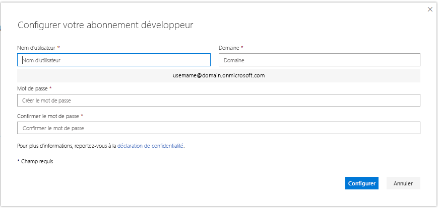

# Configurer un abonnement Microsoft 365 Développeur 

Configurez un abonnement Microsoft 365 Développeur pour créer vos solutions indépendamment de votre environnement de production. L’abonnement est un abonnement Microsoft 365 E5 Développeur avec 25 licences utilisateur. Il est valable 90 jours et est gratuit pour une utilisation à des fins de développement uniquement (solutions d’encodage). 

Les clients qui ont rejoint le programme avant le 25 août 2019 disposent d’un abonnement Office 365 E3 Développeur.

> [!NOTE] 
> Pour configurer un abonnement, vous devez d’abord [rejoindre le programme pour les développeurs Microsoft 365](microsoft-365-developer-program.md). Après avoir rejoint le programme, l’option pour configurer un abonnement s’affiche.

## Configurer votre abonnement

1. Pour obtenir un abonnement Microsoft 365 Développeur, sur votre page de profil, sélectionnez **Configurer un abonnement**.

2. Dans la boîte de dialogue **Configurer votre abonnement Développeur**, créez un nom d’utilisateur et un domaine. Ce compte disposera des autorisations d’administrateur général pour l’abonnement. Vous pouvez choisir n’importe quel nom d’utilisateur ou nom de domaine dans la mesure où il n’est pas déjà utilisé. N’utilisez pas d’espaces.

  

3. Créez et confirmez un mot de passe.

4. Sélectionnez **Configurer**.

5. Si vous êtes invité à prouver que vous n’êtes pas un robot, suivez les instructions, puis choisissez **Vérifier**.

6. Une fois l’abonnement créé, le nom et la date d’expiration de votre abonnement apparaissent sur votre page de profil.

  > [!IMPORTANT]
  > Notez votre nom d’utilisateur et votre mot de passe, car vous en aurez besoin pour accéder à votre abonnement Développeur.

## Configuration de l’abonnement

1. Sur votre page de profil, choisissez **Accéder à l'abonnement** et connectez-vous avec votre identifiant utilisateur (par exemple, nomutilisateur@domaine.onmicrosoft.com) et le mot de passe que vous avez indiqués pour votre abonnement Développeur.

   > [!NOTE] 
   > Ne vous connectez pas à votre abonnement avec votre ID de compte de programme pour les développeurs.

2. Utilisez le lanceur d’applications pour accéder au [Centre d’administration](https://admin.microsoft.com/AdminPortal/Home#/homepage).

3. Dans la page d’accueil du Centre d’administration, choisissez **Accéder à la configuration**. Cela vous permet d’accéder à la page **Configuration de Microsoft 365 E5 Développeur**.

4. **Personnalisez votre connexion et votre e-mail**. Vous pouvez connecter votre abonnement à un domaine ou simplement utiliser le sous-domaine existant que vous avez créé. Lorsque vous êtes prêt, sélectionnez **Suivant**.

5. **Ajoutez de nouveaux utilisateurs**. Vous pouvez ajouter des utilisateurs fictifs ou réels pour vous aider dans développement. Lorsque vous êtes prêt, sélectionnez **Suivant**.
    
  > [!NOTE]
  > Lorsque vous avez configuré votre abonnement, vous pouvez installer le pack de données d’exemple des Utilisateurs. Le pack d’exemples de données Utilisateurs crée 16 utilisateurs fictifs pour votre abonnement et inclut les licences pour chaque utilisateur, ainsi que les boîtes aux lettres, les noms, les métadonnées et les photos pour chacun d’entre eux. Pour plus d'informations, consultez [Installer des packs d’exemples de données](install-sample-packs.md).

6. **Attribuez des licences aux utilisateurs qui n’en ont pas**. Accordez une licence à tous les utilisateurs devant utiliser l’abonnement. Lorsque vous êtes prêt, sélectionnez **Suivant**.

7. **Partagez les informations d’identification de connexion**. Pour tous les utilisateurs réels qui accéderont à l’abonnement, vous devez leur communiquer leurs informations d’identification de connexion. Vous pouvez choisir une méthode, par exemple, l’e-mail, le téléchargement ou l’impression. Lorsque vous êtes prêt, sélectionnez **Suivant**.

8. **Installez vos applications Office**. Vous avez la possibilité d’installer des applications Office sur votre ordinateur. Lorsque vous êtes prêt, sélectionnez **Suivant**.

   > [!TIP] 
   > Lors de vos prochains accès au tableau de bord, connectez-vous avec votre compte *nomutilisateur@domaine*. onmicrosoft.com avant d’accéder au tableau de bord.

9. **Vous avez terminé la configuration**. Vous avez terminé la configuration de votre abonnement. Vous pouvez éventuellement évaluer l’expérience. Lorsque vous êtes prêt, sélectionnez **Accéder au Centre d’administration**.
    
   > [!NOTE] 
   > À ce stade, la région de l’abonnement est définie par défaut sur Amérique du Nord, quel que soit votre pays/région. Vous pouvez malgré tout poursuivre la configuration et utiliser votre abonnement Développeur.

## Configurer des services Microsoft 365

Les services principaux, tels que SharePoint et Exchange, mettront un certain temps à configurer l’abonnement. Au cours de cette étape, certaines icônes du lanceur d’applications et de la page d’accueil affichent le message suivant : **Configuration (Configuration de l’application toujours en cours)**. Cette opération ne dure pas plus d’une heure.

Une fois la configuration terminée, vous pouvez utiliser le nouvel abonnement Microsoft 365 pour le développement. L’abonnement expire au bout de 90 jours. Pour le prolonger, reportez-vous à l’article [Lorsque mon abonnement est sur le point d’expirer, puis-je le prolonger ?](microsoft-365-developer-program-faq.md#renew-subscription).

Nous vous recommandons également d’activer les options de publication pour vous assurer que vous avez accès aux dernières fonctionnalités de Microsoft 365 dès que possible. Pour plus d’informations, reportez-vous à l’article [Configurer les options de publications standard et ciblée](https://support.office.com/article/set-up-the-standard-or-targeted-release-options-in-office-365-3b3adfa4-1777-4ff0-b606-fb8732101f47).

## Configuration d’un compte Microsoft Azure

Pour certaines solutions Office, vous aurez peut-être besoin d’un compte Microsoft Azure pour créer des éléments à l’aide des services Azure. Pour configurer un compte Azure gratuit, reportez-vous à l’article [Créez votre compte gratuit Azure dès aujourd’hui](https://azure.microsoft.com/free/).

## Installer des packs d’exemples de données

Vous pouvez installer des packs d’exemples de données dans votre abonnement au programme Microsoft 365 Développeur. Les packs d’exemples de données vous permettent de gagner du temps en installant automatiquement des données et le contenu nécessaire pour créer et tester vos solutions. Ceci inclut des utilisateurs, des métadonnées et des photos fictives pour simuler un petit environnement d’entreprise. Pour plus d’informations sur les exemples de packs de données disponibles et la façon de les installer, voir [Installer des exemples de packs de données](install-sample-packs.md).

## Articles associés

- [Rejoignez le programme Développeur de Microsoft 365](microsoft-365-developer-program.md)
- [Utilisez votre abonnement pour créer des solutions Microsoft 365](build-microsoft-365-solutions.md)
- [Renouveler un abonnement arrivant à expiration](subscription-expiration-and-renewal.md)
- [FAQ sur le programme de développement Microsoft 365](microsoft-365-developer-program-faq.md)
