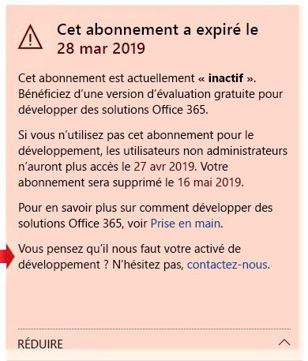

# FAQ du programme pour les développeurs Office 365

Voici les questions fréquemment posées concernant le programme pour les développeurs Office 365.

## Qu’est-ce que le programme pour les développeurs Office 365 et qui doit le rejoindre ?

Le programme Office 365 pour développeurs est conçu pour vous aider à créer des expériences de productivité multiplateforme axées sur les personnes dans la continuité d’Office 365. Rejoignez notre programme pour accéder aux outils, documentation, formation, experts et événements de communauté dont vous avez besoin pour créer des solutions adaptées pour les produits et technologies Office 365, notamment :

- Compléments web [Excel](https://developer.microsoft.com/excel), [Outlook](https://developer.microsoft.com/outlook), [Word](https://developer.microsoft.com/word), et [PowerPoint](https://developer.microsoft.com/powerpoint)
- [SharePoint](https://developer.microsoft.com/sharepoint)
- [Microsoft Teams](https://developer.microsoft.com/microsoft-teams)
- [Microsoft Graph](https://developer.microsoft.com/graph)

En tant que membre du programme, vous pouvez obtenir un abonnement pour les développeurs Office 365 gratuit avec 25 licences utilisateur à utiliser pour créer vos solutions. Cet abonnement restera actif tant que vous développez et déployez activement des solutions.

Pour plus d’informations, reportez-vous à l’article [Rejoignez le programme pour les développeurs Office 365](office-365-developer-program.md)et [Créez des solutions Office 365](build-office-365-solutions.md).
 
## Comment fonctionne l’abonnement Office 365 Développeur ?  

Vous pouvez obtenir un abonnement Office 365 pour développeur gratuit lorsque vous rejoignez le programme pour les développeurs Office 365. Cet abonnement spécial est conçu pour être utilisé uniquement pour le développement, et inclut 25 licences utilisateur. 

Après avoir rejoint le programme pour les développeurs Office 365, vous aurez la possibilité de bénéficier d’un abonnement Office 365 Développeur et de le configurer. Votre abonnement est valable 90 jours et peut être renouvelé 90 jours tant que vous l’utilisez pour toute activité de développement. 

Pour plus d’informations, reportez-vous à l’article [Configuration d’un abonnement Office 365 Développeur](office-365-developer-program-get-started.md).

## Combien de licences puis-je ajouter avec mon abonnement ?

Vous pouvez ajouter jusqu'à 25 licences utilisateur, y compris l’administrateur, uniquement à des fins de développement. L’utilisation de cet abonnement pour toute fin autre que celle de développement d’applications est une violation du contrat de licence. Pour plus d’informations sur les restrictions de licences, voir [Conditions d’utilisation de l’abonnement Office 365 pour les développeurs](terms-and-conditions.md).

## Pourquoi ne proposez-vous pas d’abonnement d’un an ?

En avril 2019, nous sommes passés à un nouveau modèle dans lequel votre abonnement peut être renouvelé perpétuellement tous les 90 jours si vous l’utilisez activement pour le développement. Nous sommes convaincus que ce modèle garantit que les développeurs participant activement au développement de solutions ont un abonnement aussi longtemps qu’ils en ont besoin. Si vous développez fréquemment, votre abonnement n’expire jamais ; il se renouvelle automatiquement. Si vous développez pendant une courte période, et que votre abonnement arrive à expiration et est supprimé, vous pouvez vous réinscrire pour un nouveau. 

Si vous préférez disposer d’un abonnement qui est disponible pour une plus longue période, nous vous recommandons de souscrire à l’abonnement Visual Studio Professional ou Visual Studio Enterprise. Ces programmes incluent un abonnement gratuit d’Office 365 pour les développeurs valable pour la durée de votre abonnement Visual Studio. Pour accéder à cela, allez à [Visual Studio | Mes avantages](https://my.visualstudio.com/benefits). Pour plus d’informations, contactez le [Service clientèle Visual Studio](https://www.visualstudio.com/subscriptions/support/). 

## Comment déterminer si un abonnement peut être renouvelé ?

Nous utilisons un ensemble d’algorithmes et télémétrie à partir de votre activité dans le programme Office 365 pour les développeurs et depuis votre abonnement pour les développeurs Office 365 pour déterminer si vous développez activement. Nous vérifions ces données régulièrement pour mettre à jour votre état et déterminer si votre abonnement doit être prolongé. 

Si vous pensez que nous avons fait une erreur sur le suivi de votre activité de développement, vous pouvez nous en faire part via votre tableau de bord. Pour envoyer un formulaire qui nous informe comment vous utilisez votre abonnement pour le développement, dans l’avertissement de tableau de bord, sélectionnez le lien **faites-nous savoir**, comme illustré dans l’image suivante. Nous examinerons votre demande et vous indiquerons si vous êtes éligible pour une extension. 

 

## Comment définissez-vous l’activité de développement ?

Votre activité dans le programme Office 365 pour les développeurs et votre abonnement pour les développeurs Office 365 déterminent si vous développez activement et si votre abonnement doit être prolongé. 

## Quelles activités de développement suivez-vous ?

Pour plus d’informations sur les types d’activités que nous suivons, voir [Conditions d’utilisation de l’abonnement Office 365 pour les développeurs](terms-and-conditions.md). 

## Qu’est-ce qu’inclut l’abonnement Office 365 Développeur ?

Votre abonnement développeur inclut les éléments suivants :

- [Exchange Online (plan 2)](https://products.office.com/exchange/compare-microsoft-exchange-online-plans)
- [Flow pour Office 365 (Plan 2)](https://flow.microsoft.com/pricing/)
- [Microsoft Forms (plan E5)](https://support.office.com/article/Frequently-asked-questions-about-Microsoft-Forms-495c4242-6102-40a0-add8-df05ed6af61c)
- [Microsoft Planner](https://products.office.com/compare-all-microsoft-office-products?tab=2)
- [Microsoft Stream pour O365 E5 SKU](https://products.office.com/business/office-365-enterprise-e5-business-software)
- [Microsoft Teams](https://products.office.com/business/office-365-enterprise-e5-business-software)
- [Gestion des périphériques mobiles pour Office 365](https://support.office.com/article/Set-up-Mobile-Device-Management-MDM-in-Office-365-dd892318-bc44-4eb1-af00-9db5430be3cd)
- [Office 365 ProPlus](https://products.office.com/business/office-365-proplus-business-software)
- [PowerApps pour Office 365 (Plan 2)](https://powerapps.microsoft.com/pricing/)
- [SharePoint Online pour développeur](https://products.office.com/SharePoint/compare-sharepoint-plans)
- [Skype Entreprise Online (plan 2)](https://products.office.com/skype-for-business/online-meeting-solutions)
- [Sway](https://sway.com/)
- [Tâches (plan 3)](https://todo.microsoft.com)

## L’abonnement inclut-il également un abonnement à Azure ?

Cette offre n’inclut pas d’un abonnement à Azure. Toutefois, pour obtenir un accès gratuit aux services Azure, vous pouvez [créer un compte Azure gratuit](https://azure.microsoft.com/free/). 

## Quelle est la durée de mon abonnement et quand expire-t-il ?

Votre abonnement est valable 90 jours et est renouvelable en fonction de l’activité développeur valide. Si vous utilisez votre abonnement pour le développement, il sera renouvelé tous les 3 mois et fonctionnera indéfiniment. Vous pouvez trouver la date d’expiration, ainsi que votre nom d’abonnement, sur le [tableau de bord du programme pour les développeurs Office 365](https://developer.microsoft.com/fr-FR/office/profile). Pour plus d’informations, voir [expiration de l’abonnement et renouvellement](subscription-expiration-and-renewal.md).

Si vous rejoignez le programme via Visual Studio Enterprise ou Visual Studio Professionnel, votre abonnement est renouvelé automatiquement jusqu'à l’expiration de votre abonnement Visual Studio. 

## Lorsque mon abonnement est sur le point d’expirer, puis-je le prolonger ?

La seule manière de prolonger votre abonnement est de maintenir une activité de développeur valide. Si vous utilisez votre abonnement pour développer des solutions personnalisées, votre abonnement expirera et finira par être supprimé. 

Pour plus d’informations, voir [expiration de l’abonnement et renouvellement](subscription-expiration-and-renewal.md).

## Si mon abonnement est sur le point d’expirer, combien de temps ai-je avant sa suppression ?

Vous disposez de 30 jours après l’expiration de votre abonnement pour migrer des données. Pendant ces 30 jours, seul l’administrateur a accès à l’abonnement et le 60ème jour, l’abonnement et toutes les données sont supprimés.

## Quel compte puis-je utiliser pour m’inscrire au programme Office 365 pour les développeurs ?

Vous pouvez vous inscrire au programme pour les développeurs à l’aide d’un des types de comptes suivants :

- **Compte Microsoft** (créé par vous pour une utilisation personnelle) : fournit un accès à tous les services cloud et produits Microsoft destinés aux consommateurs, tels que Outlook (Hotmail), Messenger, OneDrive, MSN, Xbox Live ou Office 365. Toute inscription à une boîte aux lettres Outlook.com crée automatiquement un compte Microsoft. Une fois le compte Microsoft créé, celui-ci peut être utilisé pour accéder aux services de cloud computing Microsoft liés aux consommateurs ou à Azure. 
- **Compte professionnel** (émis par un administrateur pour une utilisation professionnelle) : fournit un accès à tous les services de cloud computing Microsoft aux petites, moyennes et grandes entreprises, tels qu’Azure, Microsoft Intune ou Office 365. Lorsque vous vous inscrivez à l’un de ces services en tant qu’organisation, un répertoire informatique est automatiquement configuré dans Azure Active Directory pour représenter votre organisation. Pour plus d’informations, reportez-vous à l’article [Gérer votre répertoire Azure AD](https://docs.microsoft.com/azure/active-directory/active-directory-administer).
- **Visual Studio ID** (créé pour vos abonnements Visual Studio Professional ou entreprise) : nous vous recommandons d’utiliser cette option pour rejoindre le programme développeur à partir de la galerie Visual Studio pour profiter des avantages en tant qu’abonné Visual Studio. 
 
## En tant que partenaire Microsoft, puis-je bénéficier d’un abonnement ? 

Oui, vous pouvez suivre [ces instructions](office-365-developer-program.md) pour rejoindre le programme pour les développeurs Office 365 et configurer un abonnement Office 365 Développeur. Toutefois, si vous disposez déjà d’un abonnement Visual Studio Entreprise ou Visual Studio Professionnel (MSDN), vous pouvez obtenir un abonnement Office 365 Développeur comme bénéfice. Pour accéder à cela, allez à [Visual Studio | Mes avantages](https://my.visualstudio.com/benefits). Pour plus d’informations, contactez le [Service clientèle Visual Studio](https://www.visualstudio.com/subscriptions/support/). 

## En tant qu’employé à plein temps de Microsoft, puis-je bénéficier d’un abonnement ?

Les employés de Microsoft ne peuvent pas s’inscrire à cette offre. Cependant, tous les employés à plein temps de Microsoft ont accès à un abonnement Visual Studio (MSDN) gratuit qui inclut l’accès à Office E3 Développeur. Vous pouvez accéder à cet avantage dans [Visual Studio | Mes avantages](https://my.visualstudio.com/benefits).

## En tant que fournisseur travaillant chez Microsoft, puis-je bénéficier d’un abonnement ?

Oui, vous pouvez suivre [ces instructions](office-365-developer-program.md) pour rejoindre le programme pour les développeurs Office 365 et configurer un abonnement Office 365 Développeur. Mais même pour les fournisseurs, cet abonnement est conçu pour être utilisé _uniquement pour le développement d’applications_. Si vous n’effectuez pas d’activité de développement valide, votre abonnement ne sera pas renouvelé.

## Le programme Office 365 Développeur est-il disponible dans ma langue ?

En plus de l’anglais, le programme Office 365 pour les développeurs est disponible dans les langues suivantes : chinois (simplifié), français, allemand, japonais, portugais (Brésil), russe et espagnol.

## L’abonnement Office 365 Développeur est-il disponible dans ma langue ?

L’abonnement pour les développeurs Office 365 est proposé uniquement en anglais.

## Support

Si vous rencontrez des problèmes lors de la configuration de votre abonnement, consultez les ressources d’assistance suivantes :

- [Stack Overflow](https://stackoverflow.com/questions)   
- [Service clientèle Visual Studio](https://www.visualstudio.com/subscriptions/support/)

## Voir aussi

- [Rejoindre le programme pour les développeurs Office 365](office-365-developer-program.md)
- [Configuration d’un abonnement Office 365 Développeur](office-365-developer-program-get-started.md)
- [Utilisation de votre abonnement pour créer des solutions Office 365](build-office-365-solutions.md)
- [Renouveler un abonnement arrivant à expiration](subscription-expiration-and-renewal.md)

 

 

 

 

 

 
