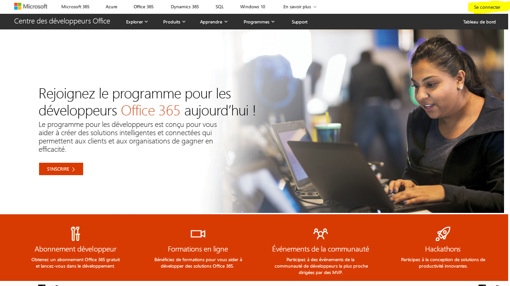
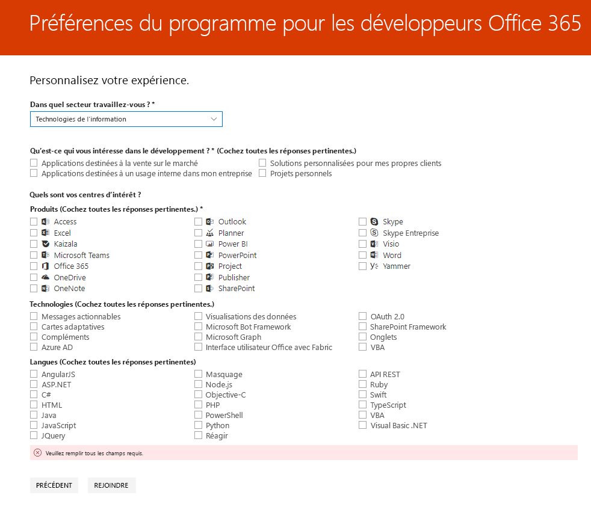
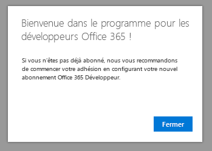

# Bienvenue dans le programme pour les développeurs Office 365

Rejoignez vos amis et vos collègues dans le programme pour les développeurs Office 365. Utilisez l’abonnement Office 365 Développeur pour développer et tester vos solutions indépendamment de votre environnement de production. Vous pouvez créer des solutions pour Microsoft Teams, les compléments Office, Microsoft Graph, SharePoint Framework, les compléments SharePoint et bien plus encore.

## Rejoindre le programme pour les développeurs Office 365

1. Accédez à la page [Rejoindre le programme pour les développeurs Office 365](https://developer.microsoft.com/fr-FR/office/dev-program). 

2. En haut à droite, sélectionnez **Se connecter** pour vous connecter avec votre compte Microsoft ou votre adresse e-mail compatible avec Azure Active Directory. 

  

3. Une fois connecté, choisissez **Rejoindre maintenant**.

4. Sur la page **Inscription au programme pour les développeurs Office 365**, renseignez les champs suivants du formulaire en ligne :

  - **E-mail du contact**
  - **Pays**
  - **Entreprise**

  

5. Consultez les **conditions générales**. Vous devez cocher la case pour rejoindre le programme.

6. Vous pouvez éventuellement cocher la case vous permettant **de recevoir l’actualité relative au programme Office 365 pour les développeurs** si vous souhaitez que Microsoft vous informe des nouvelles fonctionnalités et autres mises à jour. 

7. Cliquez sur **Suivant**.

8. Sur la page **Préférences du programme pour les développeurs Office 365**, donnez vos préférences afin que nous puissions personnaliser votre expérience, notamment :

  - Le secteur dans lequel vous travaillez.
  - Le type d’applications ou de solutions que vous aimeriez développer.
  - Les produits, technologies et langages de programmation qui vous intéressent.

  

9. Lorsque vous avez terminé, sélectionnez **Rejoindre**. Vos préférences apparaissent en haut à droite de la page suivante, et vous recevez un message d’accueil.

  

## Étapes suivantes

- [Configurez un abonnement Office 365 Développeur](office-365-developer-program-get-started.md). 

- Une fois que vous avez souscrit votre abonnement développeur, [utilisez votre abonnement](build-office-365-solutions.md) pour créer les types de solutions de votre choix.

- Pour accéder aux questions fréquemment posées concernant le programme pour les développeurs Office 365, reportez-vous à la [FAQ](office-365-developer-program-faq.md). 
