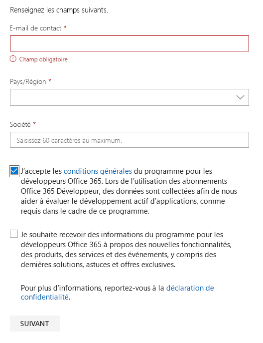

# Bienvenue dans le programme pour les développeurs Office 365Welcome to the Office 365 Developer Program

Rejoignez vos amis et vos collègues dans le programme pour les développeurs Office 365.Join your friends and colleagues in the Office 365 Developer Program. Utilisez l’abonnement Office 365 Développeur pour développer vos solutions indépendamment de votre environnement de production.Use the Office 365 developer subscription to develop your solutions independent of your production environment. Vous pouvez créer des solutions pour Microsoft Teams, les compléments Office, Microsoft Graph, SharePoint Framework, les compléments SharePoint et bien plus encore.You can build solutions for Microsoft Teams, Office Add-ins, Microsoft Graph, SharePoint Framework, SharePoint Add-ins, and more.

## Rejoindre le programme pour les développeurs Office 365Join the Office 365 Developer Program

1. Accédez à la page [Rejoindre le programme pour les développeurs Office 365](https://developer.microsoft.com/office/dev-program).Go to the [Join the Office 365 Developer Program](https://developer.microsoft.com/office/dev-program) page. 

2. En haut à droite, sélectionnez **Se connecter** pour vous connecter avec votre compte Microsoft ou votre adresse e-mail compatible avec Azure Active Directory.In the upper-right corner, choose **Sign in** to sign in with your Microsoft account or Azure Active Directory-enabled email. 

  

3. Une fois connecté, choisissez **Rejoindre maintenant**.After signing in, choose **Join now**.

4. Sur la page **Inscription au programme pour les développeurs Office 365**, renseignez les champs suivants du formulaire en ligne :On the **Office 365 Developer Program Signup** page, complete the following fields in the online form:

  - **E-mail du contact****Contact Email**
  - **Pays****Country/Region**
  - **Entreprise****Company**

  

5. Consultez les **conditions générales**.Review the **terms and conditions**. Vous devez cocher la case pour rejoindre le programme.You'll need to select the check box before you can join.

6. Vous pouvez éventuellement cocher la case vous permettant **de recevoir l’actualité relative au programme Office 365 pour les développeurs** si vous souhaitez que Microsoft vous informe des nouvelles fonctionnalités et autres mises à jour.Optionally, select the **I would like to hear from the Office 365 Developer Program** check box if you want to hear from Microsoft about new capabilities and other updates. 

7. Cliquez sur **Suivant**.Choose **Next**.

8. Sur la page **Préférences du programme pour les développeurs Office 365**, donnez vos préférences afin que nous puissions personnaliser votre expérience, notamment :On the **Office 365 Developer Program Preferences** page, tell us your preferences so we can personalize your experience, including:

  - Le secteur dans lequel vous travaillez.The industry that you work in.
  - Le type d’applications ou de solutions que vous aimeriez développer.The type of applications or solutions that you're interested in developing.
  - Les produits, technologies et langages de programmation qui vous intéressent.Products, technologies, and programming languages that you're interested in.

  

9. Lorsque vous avez terminé, sélectionnez **Rejoindre**.When you're finished, choose **Join**. Vos préférences apparaissent en haut à droite de la page suivante, et vous recevez un message d’accueil.Your preferences appear on the next page in the top right, and you receive a Welcome message.

  

## Étapes suivantesNext steps

- [Configurez un abonnement Office 365 Développeur](office-365-developer-program-get-started.md).[Set up an Office 365 developer subscription](office-365-developer-program-get-started.md). 

- Une fois que vous avez souscrit votre abonnement développeur, [utilisez votre abonnement](build-office-365-solutions.md) pour créer les types de solutions de votre choix.After you have your developer subscription, [use your subscription](build-office-365-solutions.md) to build the types of solutions that you want.

- Pour plus d’informations sur les abonnements arrivant à expiration, reportez-vous à l’article [Expiration et renouvellement d’abonnement](subscription-expiration-and-renewal.md).For information about expiring subscriptions, see [Subscription expiration and renewal](subscription-expiration-and-renewal.md).

- Pour accéder aux questions fréquemment posées concernant le programme pour les développeurs Office 365, reportez-vous à la [FAQ](office-365-developer-program-faq.md).For frequently asked questions about the Office 365 Developer Program, see the [FAQ](office-365-developer-program-faq.md).

