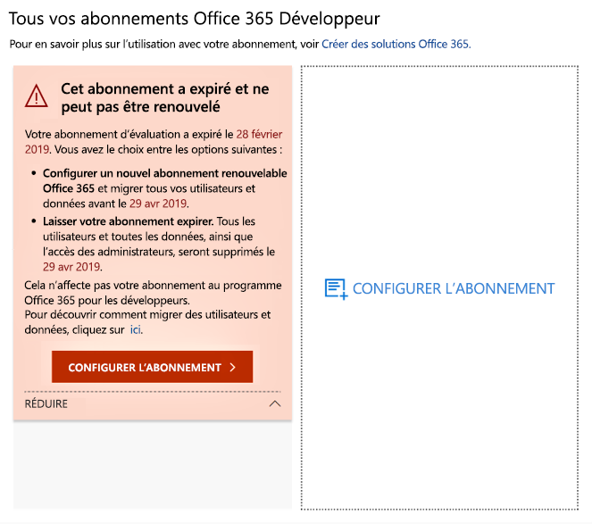
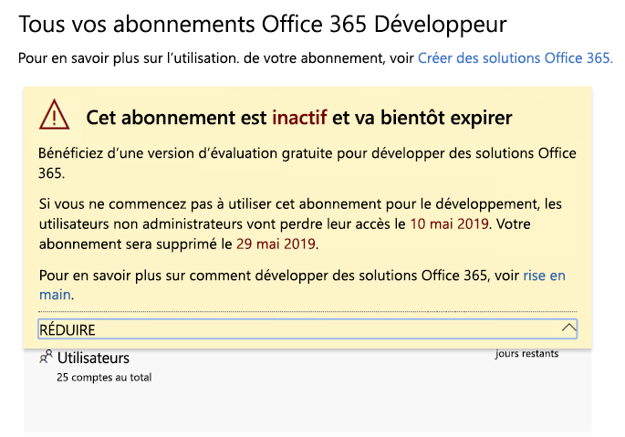
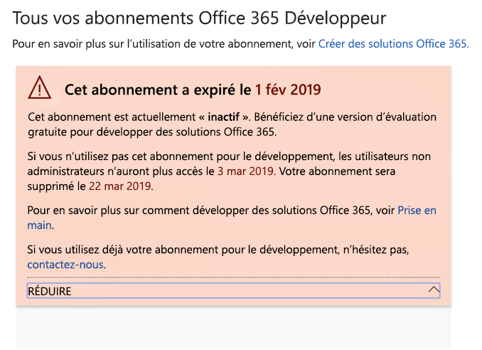
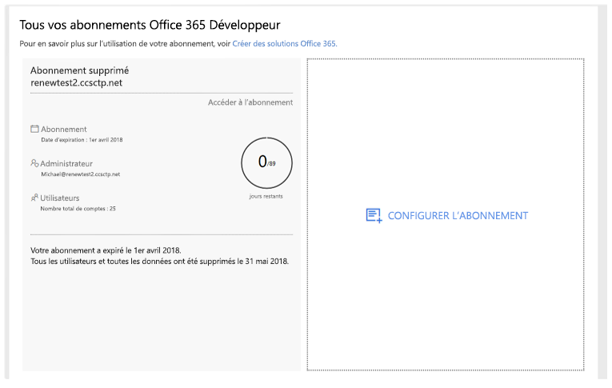

# Expiration et renouvellement d’un abonnement au programme pour les développeurs Office 365Office 365 Developer Program subscription expiration and renewal

L’adhésion au programme pour les développeurs Office 365 inclut un abonnement Office 365 Développeur gratuit.Your Office 365 Developer Program membership includes a free Office 365 developer subscription. Votre abonnement Développeur est renouvelable sur la base de votre activité de développement. Certains anciens abonnements ont toutefois une date d’expiration.Your developer subscription is renewable based on your development activity; however, some older subscriptions do expire. Cet article décrit la différence entre les abonnements renouvelables et non renouvelables, et la mise à jour de votre abonnement s’il vient à expirer.This article describes the difference between renewable and non-renewable subscriptions and how to update your subscription if it expires.

## Abonnements Développeur avec une date d’expiration ou renouvelablesExpiring vs. renewable developer subscriptions

Lors du lancement du programme pour les développeurs Office 365, nous avons proposé des abonnements Développeur sur 12 mois qui sont associés à une date d’expiration, sans possibilité de renouvellement.With the launch of the Office 365 Developer Program, we offered 12-month developer subscriptions that expire and cannot be renewed. En août 2018, nous avons commencé à proposer des abonnements renouvelables à certains membres du programme pour les développeurs.In August 2018, we started providing renewable subscriptions to some developer program members.

Depuis avril 2019, nous proposons des abonnements renouvelables sur 90 jours.Starting in April 2019, we offer renewable 90-day subscriptions.

Pour déterminer si votre abonnement est renouvelable ou non, consultez votre [tableau de bord du programme pour les développeurs Office 365](https://developer.microsoft.com/fr-FR/office/profile).You can determine whether you have a renewable or non-renewable subscription by viewing your [Office 365 Developer Program dashboard](https://developer.microsoft.com/en-us/office/profile).

## Abonnements non renouvelablesNon-renewable subscriptions

Si vous avez souscrit un abonnement avant août 2018, celui-ci n’est pas renouvelable et le message d’avertissement suivant apparaît dans votre tableau de bord.If you signed up for your subscription before August 2018, your subscription is not renewable, and you'll see the following warning on your dashboard. Vous devez remplacer votre abonnement avant l’expiration de l’abonnement actuel.You'll need to replace your subscription before your current one expires. Le texte d’avertissement spécifie que l’abonnement n’est pas renouvelable.The warning text will indicate that the subscription cannot be renewed. Nous vous enverrons également un courrier lorsque votre abonnement arrive à expiration.We'll also email you to remind you that your subscription is expiring.
 
 

Le texte d’avertissement suivant apparaîtra également.When your subscription expires, you'll see the following warning text.

 

Pour créer un abonnement de remplacement, sélectionnez **Configurer l’abonnement**.To create a replacement subscription, choose **Set Up Subscription**. 

Vous devez également migrer toutes les données importantes afin de les enregistrer dans votre nouvel abonnement.You'll also need to migrate any important data that you need to save to your new subscription. Pour plus d’informations, voir [Comment migrer mes données ?](#migrate-data) plus loin dans cette rubrique.For details, see [How do I migrate my data?](#migrate-data) later in this topic.

## Abonnements renouvelablesRenewable subscriptions

Si vous avez souscrit un abonnement après août 2018, celui-ci est peut-être renouvelable.If you signed up for your subscription before August 2018, you might have a renewable subscription. Si votre abonnement est inactif, le message d’avertissement suivant apparaîtra dans votre tableau de bord.If your subscription is inactive, you'll see the following warning on your dashbaord. 

 

Le texte d’avertissement suivant apparaîtra également.When your subscription expires, you'll see the following warning text.

 

Si vous êtes un développeur actif, votre abonnement sera renouvelé automatiquement pour une nouvelle période de 90 jours.If you're an active developer, your subscription will be renewed automatically for another 90 days. 

## Pourquoi mon abonnement actuel n’est-il pas renouvelable ?Why isn't my current subscription renewable?

Nous avons introduit les abonnements renouvelables en août 2018.We introduced renewable subscriptions in August 2018. Si vous avez souscrit votre abonnement avant, celui-ci n’est pas renouvelable et vous devez en configurer un nouveau lorsqu’il expire.If you signed up for your subscription before then, your subscription is not renewable and you'll need to set up a new one when it expires.

## Comment migrer mes données à l’expiration de mon abonnement ?How do I migrate my data when my subscription expires?

Pour migrer vos données de votre abonnement actuel vers un nouvel abonnement, consultez les ressources suivantes :To migrate your data from your current subscription to a new subscription, see the following resources:

- [Comment migrer des boîtes aux lettres d’un client Office 365 à un autreHow to migrate mailboxes from one Office 365 tenant to another](https://docs.microsoft.com/exchange/mailbox-migration/migrate-mailboxes-across-tenants)
- [Utiliser PowerShell pour effectuer une migration intermédiaire vers Office 365Use PowerShell to perform a staged migration to Office 365](https://docs.microsoft.com/office365/enterprise/powershell/use-powershell-to-perform-a-staged-migration-to-office-365)
- [Migration d’un abonnement Office 365 à un autre sans tiersMigration from one Office 365 subscription to another without third party](https://social.technet.microsoft.com/Forums/en-US/ee507441-eb91-4b0a-ba6c-5bd9bb8c71b1/migration-from-one-o365-tenant-to-another-o365-without-third-party?forum=onlineservicesmigrationandcoexistence)

## Comment savoir si mon abonnement a été supprimé ?How do I know if my subscription was deleted?

Lorsque votre abonnement est supprimé, une notification apparaît sur votre tableau de bord indiquant que l’abonnement et son ID ont été supprimés, comme illustré dans la capture d’écran suivante.When your subscription is deleted, you will see a notification on your dashboard that the subscription and its ID were deleted, as shown in the following screenshot. 

 

## Voir aussiSee also

- [Rejoindre le programme pour les développeurs Office 365Join the Office 365 Developer Program](office-365-developer-program.md)
- [Configurez un abonnement Office 365 DéveloppeurSet up an Office 365 developer subscription](office-365-developer-program-get-started.md)
- [Utilisation de votre abonnement pour créer des solutions Office 365Use your subscription to build Office 365 solutions](build-office-365-solutions.md)
- [FAQ du programme pour les développeurs Office 365Office 365 Developer Program FAQ](office-365-developer-program-faq.md)

