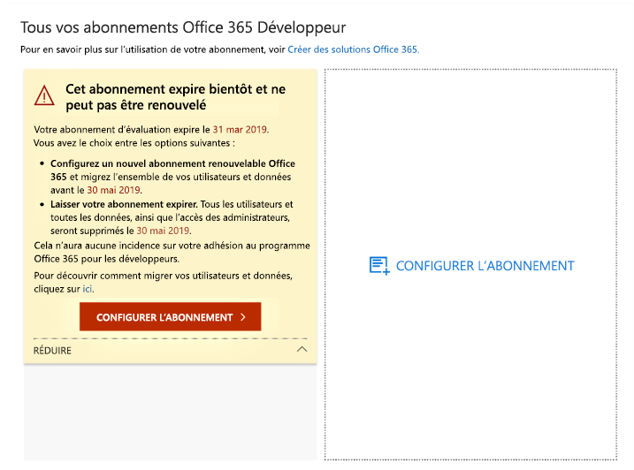

# Expiration et renouvellement d’un abonnement au programme pour les développeurs Microsoft 365

L’adhésion au programme pour les développeurs Microsoft 365 inclut un abonnement Microsoft 365 E5 pour les développeurs gratuit. Votre abonnement Développeur est renouvelable sur la base de votre activité de développement. Certains anciens abonnements ont toutefois une date d’expiration. Cet article décrit la différence entre les abonnements renouvelables et non renouvelables, et la mise à jour de votre abonnement s’il vient à expirer.

## Abonnements Développeur avec une date d’expiration ou renouvelables

Lors du lancement du programme pour les développeurs Microsoft 365, nous avons proposé des abonnements Développeur sur 12 mois qui sont associés à une date d’expiration, sans possibilité de renouvellement. En août 2018, nous avons commencé à proposer des abonnements renouvelables à certains membres du programme pour les développeurs.

Depuis avril 2019, nous proposons des abonnements renouvelables sur 90 jours.

Pour déterminer si votre abonnement est renouvelable ou non, consultez votre [tableau de bord du programme pour les développeurs Microsoft 365](https://aka.ms/DevProgramDashboard).

## Abonnements non renouvelables

Si vous avez souscrit un abonnement avant août 2018, celui-ci n’est pas renouvelable et le message d’avertissement suivant apparaît dans votre tableau de bord. Vous devez remplacer votre abonnement avant l’expiration de l’abonnement actuel. Le texte d’avertissement spécifie que l’abonnement n’est pas renouvelable. Nous vous enverrons également un courrier lorsque votre abonnement arrive à expiration.
 
 

Le texte d’avertissement suivant apparaîtra également.

 

Pour créer un abonnement de remplacement, sélectionnez **Configurer l’abonnement**. 

Vous devez également migrer toutes les données importantes afin de les enregistrer dans votre nouvel abonnement. Pour plus d’informations, voir [Comment migrer mes données ?](#migrate-data) plus loin dans cette rubrique.

## Abonnements renouvelables

Si vous avez souscrit un abonnement après août 2018, celui-ci est peut-être renouvelable. Si votre abonnement est inactif, le message d’avertissement suivant apparaîtra dans votre tableau de bord. 

 

Le texte d’avertissement suivant apparaîtra également.

 

Si vous êtes un développeur actif, votre abonnement sera renouvelé automatiquement pour une nouvelle période de 90 jours à partir de la date d’expiration. 

## Pourquoi mon abonnement actuel n’est-il pas renouvelable ?

Nous avons introduit des abonnements renouvelables en août 2018. Si vous vous êtes inscrit à votre abonnement avant cette date, votre abonnement n’est pas renouvelable et vous devrez en configurer un nouveau à son expiration.

## Comment migrer mes données à l’expiration de mon abonnement ?

Pour migrer vos données de votre abonnement actuel vers un nouvel abonnement, consultez les ressources suivantes :

- [Comment migrer des boîtes aux lettres d’un client à un autre](/exchange/mailbox-migration/migrate-mailboxes-across-tenants)
- [Utiliser PowerShell pour effectuer une migration intermédiaire](/office365/enterprise/powershell/use-powershell-to-perform-a-staged-migration-to-office-365)
- [Migration d’un abonnement à un autre sans tiers](https://social.technet.microsoft.com/Forums/en-US/ee507441-eb91-4b0a-ba6c-5bd9bb8c71b1/migration-from-one-o365-tenant-to-another-o365-without-third-party?forum=onlineservicesmigrationandcoexistence)

## Comment savoir si mon abonnement a été supprimé ?

Lorsque votre abonnement est supprimé, une notification apparaît sur votre tableau de bord indiquant que l’abonnement et son ID ont été supprimés, comme illustré dans la capture d’écran suivante. 

 

## Articles associés

- [Rejoignez le programme développeur de Microsoft 365](microsoft-365-developer-program.md)
- [Configurez un abonnement Microsoft 365 Développeur](microsoft-365-developer-program-get-started.md)
- [Utilisez votre abonnement pour créer des solutions Microsoft 365](build-microsoft-365-solutions.md)
- [FAQ sur le programme de développement Microsoft 365](microsoft-365-developer-program-faq.yml)

